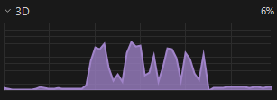

10.1 CUDA First Meeting
=======
Links
-----

`Github Repo <https://github.com/Minutenreis/tsunami_lab>`_

`User Doc <https://tsunami-lab.readthedocs.io/en/latest/>`_

Individual Contributions
------------------------

Justus Dreßler: all members contributed equally

Thorsten Kröhl: all members contributed equally

Julius Halank: all members contributed equally

Installation Instructions and First Steps 
-----------------------------------------

https://ubuntu.com/tutorials/enabling-gpu-acceleration-on-ubuntu-on-wsl2-with-the-nvidia-cuda-platform#1-overview

and

:code:`sudo apt install nvidia-cuda-toolkit`

So we wrote a little cuda programm that calculates the sum of two arrays to test if it works.
To compile it we used :code:`nvcc vectorAdd.cu  -o vectorAdd" 4000`

.. code:: cpp

  // computes the sum of two arrays
  #include <cstdlib>

  #include <cassert>
  #include <iostream>

  __global__ void vectorAdd(int *a, int *b, int *c, int N) {
      //calculate global thread id
      int tid = blockIdx.x * blockDim.x + threadIdx.x;

      //range check
      if (tid < N) {
          c[tid] = a[tid] + b[tid];
      }
  }

  void init_array( int *a, int N){
      for(int i=0; i<N; i++){
          a[i] = rand()%100;
      }
  }

  void verify_result(int *a, int *b, int *c, int N){
      for(int i=0; i<N; i++){
          assert(c[i] == a[i] + b[i]);
      }
      std::cout << "Success!\n";
  }

  int main(){
      // 2^20 elements
      int N = 1<<20;
      size_t bytes = N*sizeof(bytes);

      // allocate memory
      int *a, *b, *c;
      cudaMallocManaged(&a, bytes);
      cudaMallocManaged(&b, bytes);
      cudaMallocManaged(&c, bytes);

      // initialize array
      init_array(a, N);
      init_array(b, N);

      int THREADS = 256;

      // calculate block size
      // ist so weil N/Threads wäre nur 1 mit rest 1, so ist es 2
      int BLOCKS = (N + THREADS - 1)/THREADS;

      // launch kernel

      vectorAdd<<<BLOCKS, THREADS>>>(a, b, c, N);
      cudaDeviceSynchronize();

      // verify result
      verify_result(a, b, c, N);

      return 0;
  }

| The most interesting things about this small snippet is:
| What are blocks and threads?
| How do i calculate them?
| And for what do i need the thread id?

| So the blocks are the number of parallel processes that are running at the same time.
| The threads are the number of parallel processes that are running at the same time in one block.
| The thread id is needed to calculate the index of the array that is calculated by the thread.

To visualize this we can use the following picture:

Analysis and Modification for Cuda
----------------------------------

While analyzing we noticed that we should be able to just use cude everyhwere where we used openmp.
So we just replaced the openmp pragmas and replaced the code in it with cuda kernels.

First "victim" of our replacement where the functions that calculate ghostcell-updates.
... and we ran into the first problem:

.. video:: _static/10_cuda_ghostcells_whut.mp4
   :width: 700

maybe we should use cudaDeviceSynchronize()?...

Seems like we have an indexing problem here.

.. video:: _static/10_cuda_ghostcells_functional.mp4
   :width: 700

... and its working!

.. code:: cpp

    dim3 l_blockSize(32, 32);
    dim3 l_numBlock((m_nCellsx+2)/l_blockSize.x, (m_nCellsy+2)/l_blockSize.y);
    setGhostCellsX<<<l_numBlock,l_blockSize>>>(m_h, m_hu, m_nCellsx);
    cudaDeviceSynchronize();

.. code:: cpp

  __global__ void setGhostCellsX(tsunami_lab::t_real *io_h, tsunami_lab::t_real *io_hu, tsunami_lab::t_idx i_nx)
  {
      tsunami_lab::t_idx l_x = blockIdx.x * blockDim.x + threadIdx.x;
      tsunami_lab::t_idx l_y = blockIdx.y * blockDim.y + threadIdx.y;

      if (l_x == 0)
      {
          io_h[(i_nx+2) * l_y] = io_h[1 + (i_nx+2) * l_y];
          io_hu[(i_nx+2) * l_y] = io_hu[1 + (i_nx+2) * l_y];
      }
      else if (l_x == i_nx + 1)
      {
          io_h[l_x + (i_nx+2) * l_y] = io_h[l_x - 1 + (i_nx+2) * l_y];
          io_hu[l_x + (i_nx+2) * l_y] = io_hu[l_x - 1 + (i_nx+2) * l_y];
      }
  }

Next we replaced the init new cell quantities with a cudaMemCpy instead of iterating with a custom function:

.. code:: cpp

  cudaMemcpy(m_hTemp, m_h, (m_nCellsx+2) * (m_nCellsy+2) * sizeof(float), cudaMemcpyDeviceToDevice);

works like a charm.

Now the whole netUpdates:

Hmh. Second Tsunami?...

.. video:: _static/10_cuda_Atomic_Fail.mp4
   :width: 700

Seems like the second indexing problem again, but now in our block and thread calculation.

.. code:: cpp

  dim3 l_blockSize(16,16);
  dim3 l_numBlock((m_nCellsx+2-1)/l_blockSize.x+1, (m_nCellsy+2-1)/l_blockSize.y+1);
  initGhostCellsCuda<<<l_numBlock,l_blockSize>>>(m_b, m_nCellsx, m_nCellsy);
  cudaDeviceSynchronize();

and this short snippet to limit the threads to the actual number of cells:

.. code:: cpp

    if (l_x > i_nx + 1 || l_y > i_ny + 1)
    {
        return;
    }

snippet of netUpdateX changes:

.. code:: cpp

  __global__ void netUpdatesX(tsunami_lab::t_real *o_h, tsunami_lab::t_real *o_hu, tsunami_lab::t_real *i_hTemp,tsunami_lab::t_real * i_huvTemp, tsunami_lab::t_real *i_b, tsunami_lab::t_idx i_nx, tsunami_lab::t_idx i_ny, tsunami_lab::t_real i_scaling)
  {
      tsunami_lab::t_idx l_x = blockIdx.x * blockDim.x + threadIdx.x;
      tsunami_lab::t_idx l_y = blockIdx.y * blockDim.y + threadIdx.y;

      if (l_x > i_nx + 1 || l_y > i_ny + 1)
      {
          return;
      }

      // determine left and right cell-id
      tsunami_lab::t_idx l_ceL = l_x + l_y * (i_nx + 2);
      tsunami_lab::t_idx l_ceR = l_x + 1 + l_y * (i_nx + 2);

      // compute net-updates
      tsunami_lab::t_real l_netUpdates[2][2];

      netUpdatesCUDA(i_hTemp[l_ceL],
                     i_hTemp[l_ceR],
                     i_huvTemp[l_ceL],
                     i_huvTemp[l_ceR],
                     i_b[l_ceL],
                     i_b[l_ceR],
                     l_netUpdates[0],
                     l_netUpdates[1]);

      // update the cells' quantities
      atomicAdd(&o_h[l_ceL], -i_scaling * l_netUpdates[0][0]);
      atomicAdd(&o_hu[l_ceL], -i_scaling * l_netUpdates[0][1]);

      atomicAdd(&o_h[l_ceR], -i_scaling * l_netUpdates[1][0]);
      atomicAdd(&o_hu[l_ceR], -i_scaling * l_netUpdates[1][1]);
  }

and the simulation is working!

.. video:: _static/10_cuda_atomic_working.mp4
   :width: 700

Short Performance Observation in Taskmanager
--------------------------------------------

Seems like a lot of spiking.
Probably because of the atomicAdd() and cudaDeviceSynchronize() functions.

But this is for the next time :)