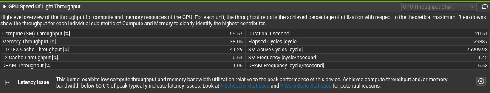
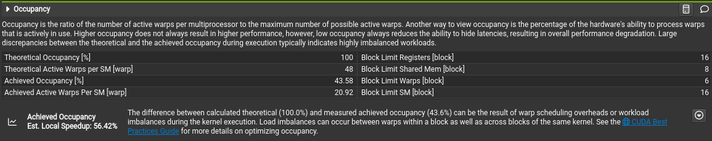
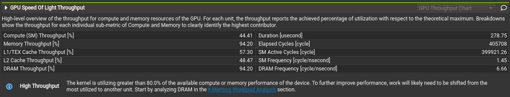
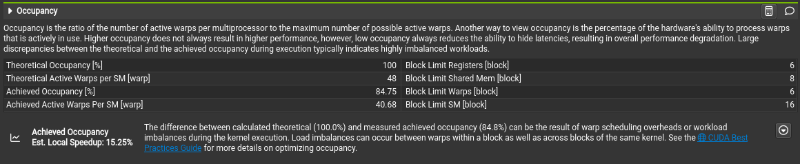

10.2 CUDA Final Report
=======
Links
-----

`Github Repo <https://github.com/Minutenreis/tsunami_lab>`_

`User Doc <https://tsunami-lab.readthedocs.io/en/latest/>`_

Individual Contributions
------------------------

Justus Dreßler: all members contributed equally

Thorsten Kröhl: all members contributed equally

Julius Halank: all members contributed equally

MS-1 Preparation
----------------

We read through the CUDA C++ Documentation (well part of it) and applied it to a small test example.
The test example (in /cudeTests) consisted of a simple vector addition kernel and a main function to test it.
We did initialy pick up a bad habit from it though which is `cudaMallocManaged`, since this turned out to severely slow down the code.

.. code:: cpp

    __global__ void vectorAdd(int *a, int *b, int *c, int N) {
        //calculate global thread id
        int tid = blockIdx.x * blockDim.x + threadIdx.x;

        //range check
        if (tid < N) {
            c[tid] = a[tid] + b[tid];
        }
    }

*Vector Addition Kernel*

It helped us understand the way the GPU calls our code though.
Each thread is calling the function with the same parameters except an implicit index given too it, which is its position in all threads.
We used this later to tell each thread which cell to calculate in the simulation.
CUDA makes 2D programming very easy in that case because we can just get a 2D thread id and use it to index our 2D arrays.

MS-2 Initial Kernel Development
-------------------------------

We identified (to no ones surprise) that the key area we could speed up was the WavePropagate class.
Since its dependent on the solvers, we decided that we would always use FWave for the GPU version.
We then implemented the `tsunami_lab::patches::WavePropagationCUDA` class, first by copying the `WavePropagation2D` class and then modifying it to use CUDA.
We first only implemented the `setGhostCells` functions on the GPU, since it was the easiest to implement and most self contained.

.. code:: cpp

    __global__ void setGhostCellsX(tsunami_lab::t_real *io_h, tsunami_lab::t_real *io_hu, tsunami_lab::t_idx i_nx, tsunami_lab::t_idx i_ny, tsunami_lab::t_boundary i_boundaryLeft, tsunami_lab::t_boundary i_boundaryRight)
    {
        tsunami_lab::t_idx l_x = blockIdx.x * blockDim.x + threadIdx.x;
        tsunami_lab::t_idx l_y = blockIdx.y * blockDim.y + threadIdx.y;
        if (l_x > i_nx + 1 || l_y > i_ny + 1)
        {
            return;
        }

        if (l_x == 0 && i_boundaryLeft == tsunami_lab::t_boundary::OPEN)
        {
            io_h[(i_nx+2) * l_y] = io_h[1 + (i_nx+2) * l_y];
            io_hu[(i_nx+2) * l_y] = io_hu[1 + (i_nx+2) * l_y];
        }
        else if (l_x == i_nx + 1 && i_boundaryRight == tsunami_lab::t_boundary::OPEN)
        {
            io_h[l_x + (i_nx+2) * l_y] = io_h[l_x - 1 + (i_nx+2) * l_y];
            io_hu[l_x + (i_nx+2) * l_y] = io_hu[l_x - 1 + (i_nx+2) * l_y];
        }
    }

*Ghost Cell Setter Kernel*

They worked quite well after figuring out some indexing issues.
Admittedly they are far from optimal in regards to performance since we spawn a thread for each cell despite only needing to calculate the ghost cells.
This means we are spawning a lot of threads that just instantly finish.
We ignored this though, since the code was working first and later turned out to run fast enough to not be a bottleneck anyways.

While developing the `setGhostCells` kernels we figured out a nice performance improvement to our code.
In our initial code we modified the bathymetry cells in each `setGhostCells` call.
This is not necessary since the bathymetry is constant and we can just copy it once at the start of the simulation.
So we added a `initGhostCells` function to the `WavePropagationCUDA` and `WavePropagation2D` classes which sets the bathymetry for the ghost cells.
This reduces the amount of writes in each `setGhostCells` call by 33%.

We also went a bit ahead of the schedule and already implemented all the other kernels for the `timeStep(i_scaling)` function at the heart of the simulation.

.. code:: cpp

    void tsunami_lab::patches::WavePropagationCUDA::timeStep(t_real i_scaling)
    {
        dim3 l_blockSize(16, 16);
        dim3 l_numBlock((m_nCellsx+2-1)/l_blockSize.x+1, (m_nCellsy+2-1)/l_blockSize.y+1);

        setGhostCellsX<<<l_numBlock,l_blockSize>>>(m_h, m_hu, m_nCellsx, m_nCellsy, m_boundaryLeft, m_boundaryRight);

        cudaMemcpy(m_hTemp, m_h, (m_nCellsx+2) * (m_nCellsy+2) * sizeof(float), cudaMemcpyDeviceToDevice);
        cudaMemcpy(m_huvTemp, m_hu, (m_nCellsx+2) * (m_nCellsy+2) * sizeof(float), cudaMemcpyDeviceToDevice);
        netUpdatesX<<<l_numBlock,l_blockSize>>>(m_h, m_hu, m_hTemp, m_huvTemp, m_b, m_nCellsx, m_nCellsy, i_scaling);

        setGhostCellsY<<<l_numBlock,l_blockSize>>>(m_h, m_hv, m_nCellsx, m_nCellsy, m_boundaryBottom, m_boundaryTop);

        cudaMemcpy(m_hTemp, m_h, (m_nCellsx+2) * (m_nCellsy+2) * sizeof(float), cudaMemcpyDeviceToDevice);
        cudaMemcpy(m_huvTemp, m_hv, (m_nCellsx+2) * (m_nCellsy+2) * sizeof(float), cudaMemcpyDeviceToDevice);
        netUpdatesY<<<l_numBlock,l_blockSize>>>(m_h, m_hv, m_hTemp, m_huvTemp, m_b, m_nCellsx, m_nCellsy, i_scaling);
    }

*Time Step Function*

This timestep function still follows the old structure of the `WavePropagation2D` class, but encapsulates all actions into kernels.
The `(m_nCellsx+2-1)/l_blockSize.x+1` in the l_numBlock calculation might seem a bit odd, but it is just a way to calculate the integer ceil of `(m_nCellsx+2)/l_blockSize.x`.
Taking the ceil is necessary since we might not have a perfect multiple of the block size in the number of cells and with our structure we can't spawn less threads than cells.
`cudaMemcpyDeviceToDevice` replaced the `std::copy` calls from the CPU version since we now have to move our data on the GPU and assume that cudaMemcpy is faster than our own implementation would be.
We also use the property of CUDA that we can call multiple kernels in a row and they automatically get executed in order (so we have no race conditions that f.E. `cudaMemcpy` starts before the `setGhostCells` function finishes).

While developing the `netUpdates` kernels we noticed that we had to integrate the `FWave` solver into the same file since kernels are limited to calling code defined in the same file.
So we just copied the `FWave` solver into the `WavePropagationCUDA` class and made it a `__device__` function, meaning it can only be called from the GPU.

.. code:: cpp

    __global__ void netUpdatesY(tsunami_lab::t_real *o_h, tsunami_lab::t_real *o_hv, tsunami_lab::t_real *i_hTemp,tsunami_lab::t_real *i_huvTemp, tsunami_lab::t_real *i_b, tsunami_lab::t_idx i_nx, tsunami_lab::t_idx i_ny, tsunami_lab::t_real i_scaling)
    {
        tsunami_lab::t_idx l_x = blockIdx.x * blockDim.x + threadIdx.x;
        tsunami_lab::t_idx l_y = blockIdx.y * blockDim.y + threadIdx.y;

        if (l_x > i_nx + 1 || l_y > i_ny + 1)
        {
            return;
        }
        // determine top and bottom cell-id
        tsunami_lab::t_idx l_ceB = l_x + l_y * (i_nx + 2);
        tsunami_lab::t_idx l_ceT = l_x + (l_y + 1) * (i_nx + 2);

        // compute net-updates
        tsunami_lab::t_real l_netUpdates[2][2];

        netUpdatesCUDA(i_hTemp[l_ceB],
                       i_hTemp[l_ceT],
                       i_huvTemp[l_ceB],
                       i_huvTemp[l_ceT],
                       i_b[l_ceB],
                       i_b[l_ceT],
                       l_netUpdates[0],
                       l_netUpdates[1]);

        // update the cells' quantities
        atomicAdd(&o_h[l_ceB], -i_scaling * l_netUpdates[0][0]);
        atomicAdd(&o_hv[l_ceB], -i_scaling * l_netUpdates[0][1]);

        atomicAdd(&o_h[l_ceT], -i_scaling * l_netUpdates[1][0]);
        atomicAdd(&o_hv[l_ceT], -i_scaling * l_netUpdates[1][1]);
    }

*Net Updates Kernel*

Another important update was adding `atomicAdd()` around our writes to the `o_h` and `o_hv` arrays since we can no longer guarantee that no 2 kernels write to the same cell at the same time.

We also updated the `Constructor` of the class to reserve both memory on the GPU and the CPU (with only the GPU needing the temporary arrays).
We used `cudaMalloc` instead of `cudaMallocManaged` since we want those arrays to always be on the GPU instead of a first touch policy approach.
The extra arrays on the CPU only get used for initialization of all the cells and later getting the data back from the class to the writer.
For the latter we now mandate a prior call to a `prepareDataAccess` function which waits for the GPU to finish its calculation and then copies the data from the GPU to the CPU.

.. code:: cpp

    void tsunami_lab::patches::WavePropagationCUDA::prepareDataAccess()
    {
        cudaDeviceSynchronize();
        cudaMemcpy(m_h_host, m_h, (m_nCellsx+2) * (m_nCellsy+2) * sizeof(float), cudaMemcpyDeviceToHost);
        cudaMemcpy(m_hu_host, m_hu, (m_nCellsx+2) * (m_nCellsy+2) * sizeof(float), cudaMemcpyDeviceToHost);
        cudaMemcpy(m_hv_host, m_hv, (m_nCellsx+2) * (m_nCellsy+2) * sizeof(float), cudaMemcpyDeviceToHost);
    }

*Data Access Preparation Function*

MS-3 implementation
-------------------

With much work already done in week 2, we didn't really touch the `WavePropagationCUDA` class in week 3 outside of a few tweaks, none with major impact.
We did however start testing our performance of the CUDA version against the CPU version.
It turned out to be much much faster in calculation, so much so that our calls to `NetCdf` became the major bottleneck instead.

Example Data of a run with the Tohoku Simulation, with 1000m Cellsize, 100 Frames and 18000 seconds simulated time:

.. code::

    total time: 2min 48s 378ms 535us 507ns
    setup time: 1s 73ms 223us 470ns
    calc time : 12s 369ms 302us 895ns
    write time: 2min 34s 936ms 9us 142ns

*CUDA Performance*

.. code::

    total time: 3min 47s 819ms 319us 488ns
    setup time: 1s 806ms 745us 853ns
    calc time : 3min 14s 908ms 392us 693ns
    write time: 31s 104ms 180us 942ns

*CPU Performance*

*Both tests were run on an Intel i5-13600k, an NVIDIA RTX 3070 and 32GB of DDR5 RAM @ 6000MHz*

The calculation time reduced drastically, by a factor of about 15, but the write time increased by a factor of about 5.
This leads to a total time improvement of only 35%, which is pretty disappointing seeing the large improvement in the calculation time.
We couldn't figure out why the write time increased so much, since from the perspective of the NetCdf library our data should be the same.
We also noticed an issue that our simulation was sometimes "stuttering", meaning that sometimes Frames took significantly longer to be written than others.
This also sometimes happened in the `setup`, which increased setup times from ~2s to over 40s.
We couldn't identify whether the culprit was something in our use of the NetCdf library or the CUDA library.

MS-4 Testing
------------

We did not further optimize our CUDA code in this step despite setting out to seeing as the write time was dominating our total time now.
This made changes to our CUDA code not seem very impactful.
We did run the code through NVIDIAs NSight Compute profiles (the newer version of NVProf):

    Set Ghost Cells Kernel Profile

We already alluded to this in `MS-2 Initial Kernel Development` section, but here we have the proof that our throughput and occupancy are quite low.
This is due to the fact that we spawn a thread for each cell, despite only needing to calculate the ghost cells (so the vast majority of threads are doing nothing).
We did not change this as despite its low throughput it was overall only a very minor part of the total time.
As a reference the `netUpdates` kernels take 14 times as long as the `setGhostCells` kernels.
The maximum calculation time speedup then would be around 7%, which is not bad but we deemed it not worth the time investment since the calculation time overall is (depending on number of frames) only about 8% of the total time as well.
Which would make the maximum total time speedup of the `setGhostCells` kernels about 0.6%.

    Net Updates Kernel Profile

This looks pretty good, we seem to have a good occupancy and a good memory throughput.
We see that we are bottlenecked by the memory throughput, but we can't really do anything about that.
Overall we are happy with these results.

We also ran the coda with differing resolutions on Ara:

*All tests were run with 100 frames and 18000 seconds simulated time with the CUDA kernels*

+----------------+---------------------------------+------------------------+------------------------+---------------------------------+
| Resolution     | Total Time                      | Setup Time             | Calculation Time       | Write Time                      |
+================+=================================+========================+========================+=================================+
| 4000m          |                                 |                        |                        |                                 |
+----------------+---------------------------------+------------------------+------------------------+---------------------------------+
| 2000m          |                                 |                        |                        |                                 |
+----------------+---------------------------------+------------------------+------------------------+---------------------------------+
| 1000m          |                                 |                        |                        |                                 |
+----------------+---------------------------------+------------------------+------------------------+---------------------------------+
| 500m           |                                 |                        |                        |                                 |
+----------------+---------------------------------+------------------------+------------------------+---------------------------------+

*Performance on Ara with 2 NVIDIA Tesla P100 GPU's, 2 Intel Xeon E5-2660v4 CPUs and 128GB DDR4 RAM*

..
    todo: add comments to ara's performance

And since we saw that our limiting factor was the write time we tested our code with differing amounts of frames:

*All tests were run with 1000m resolution and 18000 seconds simulated time with the CUDA kernels on an Intel i5-13600k, an NVIDIA RTX 3070 and 32GB of DDR5 RAM @ 6000MHz*

+----------------+---------------------------------+------------------------+------------------------+---------------------------------+
| Frames         | Total Time                      | Setup Time             | Calculation Time       | Write Time                      |
+================+=================================+========================+========================+=================================+
| 100            | 2min 39s 116ms 662us 561ns      | 1s 905ms 48us 542ns    | 12s 266ms 751us 226ns  | 2min 24s 944ms 862us 793ns      |
+----------------+---------------------------------+------------------------+------------------------+---------------------------------+
| 75             | 1min 26s 759ms 169us 619ns      | 1s 226ms 376us 879ns   | 12s 277ms 471us 7ns    | 1min 13s 255ms 321us 733ns      |
+----------------+---------------------------------+------------------------+------------------------+---------------------------------+
| 50             | 19s 630ms 698us 731ns           | 1s 149ms 982us 374ns   | 12s 680ms 54us 844ns   | 5s 800ms 661us 513ns            |
+----------------+---------------------------------+------------------------+------------------------+---------------------------------+
| 25             | 14s 688ms 777us 997ns           | 1s 120ms 59us 687ns    | 12s 518ms 198us 788ns  | 1s 50ms 519us 522ns             |
+----------------+---------------------------------+------------------------+------------------------+---------------------------------+

*Performance with differing amounts of frames using CUDA kernel*

+----------------+---------------------------------+------------------------+-------------------------------+---------------------------------+
| Frames         | Total Time                      | Setup Time             | Calculation Time              | Write Time                      |
+================+=================================+========================+===============================+=================================+
| 100            | 4min 10s 389ms 335us 964ns      | 2s 139ms 793us 127ns   | 3min 22s 811ms 868us 815ns    | 45s 437ms 674us 22ns            |
+----------------+---------------------------------+------------------------+-------------------------------+---------------------------------+
| 75             | 4min 16s 535ms 842us 722ns      | 898ms 301us 662ns      | 3min 58s 287ms 648us 191ns    | 17s 349ms 892us 869ns           |
+----------------+---------------------------------+------------------------+-------------------------------+---------------------------------+
| 50             | 3min 21s 543ms 143us 507ns      | 839ms 248us 187ns      | 3min 17s 390ms 728us 987ns    | 3s 313ms 166us 333ns            |
+----------------+---------------------------------+------------------------+-------------------------------+---------------------------------+
| 25             | 3min 29s 606ms 801us 293ns      | 796ms 630us 221ns      | 3min 27s 603ms 875us 928ns    | 1s 206ms 295us 144ns            |
+----------------+---------------------------------+------------------------+-------------------------------+---------------------------------+

*Performance with differing amounts of frames using our parallelized CPU code*

We see that the write time scales non linearly with the amount of frames.
The time difference did not matter much in the CPU code as the simulation is slower despite the write taking quite a bit of time.
For the CUDA code it might be advisable to reduce the amount of frames to reduce the write time significantly.
If the application would support it it would probably be beneficial to seperate the simulation into multiple smaller files to keep the writes performant.
Ultimately a better parallizable and chunkable format would probably be advisable if one were to develop the simulation further.
We don't know why the writes take so much longer on the CUDA version than on the CPU version.
NetCdf might have a maximum throughput problem when processing large files and wait for function calls asynchronously to finish.
In that case the faster simulation would hinder the libraries ability to hide the write time behind the calculation time.

Regarding the calculation accuracy we lacked the tools to properly validate the accuracy of our CUDA code beyond the eye test.
We never validated our CPU code so we can't even compare the two for validation.
You may look below for a visual "eye test" of the CUDA code, but this is of course not a proper validation.

.. video:: _static/10_Tohoku_CUDA_Final.mp4
    :width: 700

*Tohoku Simulation with 1000m Cellsize, 100 Frames and 18000 seconds simulated time on CUDA*

Goals
-----

We had 2 goals for this individual phase:

1. Increase performance by at least 2 times compared to the parallelized CPU code
2. Don't compromise the accuracy of the simulation while doing so

Regarding the calculation time we definitely achieved our first goal.
We went from over 3 minutes to about 12 seconds, which is a speedup of about 15 times.

Regarding the total time though it depends a lot on the amount of frames.
With low frames (<= 50) we still reached our goal with a speedup of about 9 times.
If we increase the amount of frames to 100 though we reduce our speedup to a meager 1.25 times.

Regarding the accuracy of our simulation we can't really say much.
We did not see any obvious problems while visualizing the simulation (see above for example), but we noticed we had neither validated the CPU nor the GPU variation for accuracy.
We also lacked the knowledge to properly run the validation tests so we can only say that "it looks good", which is not a proper validation.