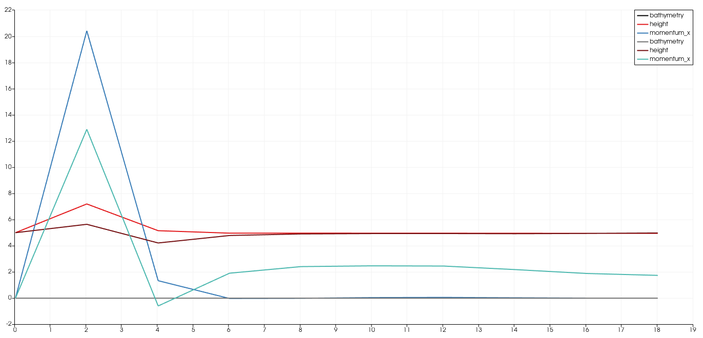

Tsunami Report 4 Two-Dimensional Solver
=============================================

Links
-----

`Github Repo <https://github.com/Minutenreis/tsunami_lab>`_

`User Doc <https://tsunami-lab.readthedocs.io/en/latest/>`_

Individual Contributions
------------------------

Justus Dreßler: all members contributed equally

Thorsten Kröhl: all members contributed equally

Julius Halank: all members contributed equally

4.1. Dimensional Splitting
--------------------------

4.1.1 Add support for two-dimensional problems to the solver
^^^^^^^^^^^^^^^^^^^^^^^^^^^^^^^^^^^^^^^^^^^^^^^^^^^^^^^^^^^^

Since our new patch (:code:`WavePropagation2d`) needs to support two-dimensional data, we have chosen the arrays in it to be a row-major representation of the 2D data.
To simplify access to specific cells we have written a helper function that calculates the index of a cell in the array from its coordinates.

.. code:: cpp

    tsunami_lab::t_idx tsunami_lab::patches::WavePropagation2d::getCoord(t_idx i_x, t_idx i_y)
    {
        return i_x + i_y * (m_nCellsx + 2);
    }

To iterate over the new data ignoring the ghost cells we adjusted the previous 1 loop into 2 loops that iterate over the cells in each dimension.

.. code:: cpp

      for (t_idx l_ex = 0; l_ex < m_nCellsx + 1; l_ex++)
        for (t_idx l_ey = 0; l_ey < m_nCellsy + 1; l_ey++)

We also make 2 sweeps over the array (one in x direction and then on the interim result one in the y direction) to calculate the new values for each of the cells.
It also now supports boundary conditions for all 4 directions instead of just 2. 
This is supported in the :code:`main` by parsing the string into 4 substrings and using a default value for all strings not matching either condition name (especially the empty string if one doesn't input a condition at all).

.. code:: cpp

      // split string by space
      std::stringstream l_stream(l_arg);
      std::string l_boundaryLName, l_boundaryRName, l_boundaryBName, l_boundaryTName;
      l_stream >> l_boundaryLName >> l_boundaryRName >> l_boundaryBName >> l_boundaryTName;

      std::cout << "  using boundary conditions " << l_boundaryLName << " " << l_boundaryRName << std::endl;

      // convert to t_boundary
      getBoundary(l_boundaryLName, &l_boundaryL);
      getBoundary(l_boundaryRName, &l_boundaryR);
      getBoundary(l_boundaryBName, &l_boundaryB);
      getBoundary(l_boundaryTName, &l_boundaryT);

We also had to change the :code:`csv.cpp` functions to support data with ghost cells so the :code:`csv::write` function now looks like this:

.. code:: cpp

    // iterate over all cells
  for (t_idx l_iy = i_ghostCellsY; l_iy < i_ny + i_ghostCellsY; l_iy++)
  {
    for (t_idx l_ix = i_ghostCellsX; l_ix < i_nx + i_ghostCellsX; l_ix++)
    {
      // derive coordinates of cell center
      t_real l_posX = (l_ix - i_ghostCellsX + 0.5) * i_dxy + i_offsetX; // ghost cells don't count for distance
      t_real l_posY = (l_iy - i_ghostCellsY + 0.5) * i_dxy + i_offsetY; // ghost cells don't count for distance

We ignore the ghost cells and deduct them in the calculation of the position.
Also visible here is a slight change in the setup to support offsets in startvalue, so now not all domains start at 0 but can be offset by a given value to start at an arbitrary point.

4.1.2 Implement a circular dam break setup
^^^^^^^^^^^^^^^^^^^^^^^^^^^^^^^^^^^^^^^^^^

The circular dam break setup is enabled by the aforementioned offset in the start values.
This allows us to represent negative values of x in our array by just shifting the start position of the array.

.. code:: cpp

    else if (l_setupName == "DAMBREAK2D")
    {
        std::cout << "  using DamBreak2d() setup" << std::endl;
        l_setup = new tsunami_lab::setups::DamBreak2d();
        l_width = 100;
        l_ny = l_nx; // square domain
        l_xOffset = -50;
        l_yOffset = -50;
        l_endTime = 20;
    }

The setup itself is a simple if statement that checks if the cell is inside the circle and sets the height accordingly.

.. code:: cpp

    tsunami_lab::t_real tsunami_lab::setups::DamBreak2d::getHeight(t_real i_x,
                                                                   t_real i_y) const
    {
    if (std::sqrt(i_x * i_x + i_y * i_y) < 10)
        return 10;
    else
        return 5;
    }

Which looks simulated like this (wall boundary on all sides and simulating 20 seconds):

.. video:: _static/4_damBreak2d_wall_box.mp4
  :width: 700
  :autoplay:
  :loop:
  :nocontrols:
  :muted:

4.1.3 Illustrate your support for bathymetry in two dimensions
^^^^^^^^^^^^^^^^^^^^^^^^^^^^^^^^^^^^^^^^^^^^^^^^^^^^^^^^^^^^^^

Adding an obstacle to the setup is done by adjusting the height statement to return 0 if the cell is inside the obstacle (bathymetry > 0) and adjusting the bathymetry accordingly.

.. code-block:: cpp
    :emphasize-lines: 4,5

    tsunami_lab::t_real tsunami_lab::setups::DamBreak2d::getHeight(t_real i_x,
                                                                   t_real i_y) const
    {
    if (getBathymetry(i_x, i_y) > 0) // obstacle
        return 0;
    if (std::sqrt(i_x * i_x + i_y * i_y) < 10)
        return 10;
    else
        return 5;
    }

The obstacle itself is a simple wall at x e [30,32] and y e [-40,40].

.. code:: cpp

    tsunami_lab::t_real tsunami_lab::setups::DamBreak2d::getBathymetry(t_real i_x,
                                                                       t_real i_y) const
    {
        if (i_x >= 30 && i_x <= 32 && i_y >= -40 && i_y <= 40)
        {
            return 10;
        }
        return -10;
    }

Which leads to the following simulation (open boundary on all sides and simulating 20 seconds):

.. video:: _static/4_damBreak2d_bathymetry_wall.mp4
  :width: 700
  :autoplay:
  :loop:
  :nocontrols:
  :muted:

4.2. Stations
-------------

4.2.1 & 4.2.2 Add a new class tsunami_lab::io::Stations
^^^^^^^^^^^^^^^^^^^^^^^^^^^^^^^^^^^^^^^^^^^^^^^^^^^^^^^

We added a new class :code:`tsunami-lab::io::Stations` that is responsible for reading and writing the station data.

It reads the station config from a :code:`json` file on initialization with the following format:

.. code:: javascript

   {
      "period": float,
      "stations": [
         {
            "name": string,
            "x": float,
            "y": float
         },
         ...
      ]
   }

and uses the `nlohmann::json <https://github.com/nlohmann/json>`_ library to parse it. 
Its again a header only library like the `rapidcsv <https://github.com/d99kris/rapidcsv>`_ library in our :code:`csv` class.

.. code:: cpp

    using json = nlohmann::json;

    tsunami_lab::io::Stations::Stations(const std::string path)
    {
        std::ifstream f(path);
        json data = json::parse(f);

        t_real l_frequency = data["period"];

        m_T = 1.0 / l_frequency;
        m_stations = data["stations"];
    }

with :code:`m_stations` being a :code:`std::vector` of :code:`t_station` objects.

.. code:: cpp

    struct t_station
    {
        std::string name;
        t_real x;
        t_real y;
    };

The writing of the data is done by iterating over the stations and writing the data to a file with the name of the :code:`station_<stationName>`.
To achieve this we first initiate the new csv files for all stations with :code:`init()`:

.. code:: cpp
    
    void tsunami_lab::io::Stations::init()
    {
        for (t_station l_station : m_stations)
        {
            std::string l_path = "stations/station_" + l_station.name + ".csv";
            std::ofstream l_file;
            l_file.open(l_path);
            l_file << "time,height,momentum_x,momentum_y,bathymetry" << std::endl;
        }
    }

Afterwards we write the data each time the a new multiple of :code:`frequency`, defined in the json config file, is reached.

.. code:: cpp

    if (l_useStations && l_simTime > l_nFreqStation * l_stations->getT())

and then appends the data of the current simulationtime to each station file, should the station be inside the domain.

.. code:: cpp

    void tsunami_lab::io::Stations::write(t_real i_dxy,
                                          t_idx i_nx,
                                          t_idx i_ny,
                                          t_idx i_stride,
                                          t_idx i_ghostCellsX,
                                          t_idx i_ghostCellsY,
                                          t_real i_simTime,
                                          t_real i_offsetX,
                                          t_real i_offsetY,
                                          t_real const *i_h,
                                          t_real const *i_hu,
                                          t_real const *i_hv,
                                          t_real const *i_b)
    {
        for (t_station l_station : m_stations)
        {
            if (l_station.x - i_offsetX < 0 || l_station.x - i_offsetX > i_nx * i_dxy || l_station.y - i_offsetY < 0 || l_station.y - i_offsetY > i_ny * i_dxy)
                continue; // station is outside of the domain

            t_idx l_ix = (l_station.x - i_offsetX) / i_dxy + i_ghostCellsX;
            t_idx l_iy = (l_station.y - i_offsetY) / i_dxy + i_ghostCellsY;
            t_idx l_id = l_ix + l_iy * i_stride;

            std::string l_path = "stations/station_" + l_station.name + ".csv";
            std::ofstream l_file;
            l_file.open(l_path, std::ios_base::app);
            l_file << i_simTime << "," << i_h[l_id] << "," << i_hu[l_id] << "," << i_hv[l_id] << "," << i_b[l_id] << std::endl;
        }
    }

4.2.3 Use a symmetric problem setup
^^^^^^^^^^^^^^^^^^^^^^^^^^^^^^^^^^^

A comparison between our :code:`WavePropagation1d` (top in legend) vs our :code:`WavePropagation2d` (bottom in legend).
Both runs use our :code:`DamBreak2d` setup with constant bathymetry with an open boundary on all sides and a station at (15,0).
The wavespeeds seem unaffected by modelling the second dimension.
The peaks are higher and troughs lower for the 1d case though.
The explanation probably lies in the balancing of the heights in the 2d case.
Instead of just front and back the cells also flow out to the sides (and getting flown back from them) which makes peaks lower and troughs higher.
We see that in the end both end with the same solution though, which probably is mainly caused by the open outflow condition on all sides and it regressing to the initial 5m height.