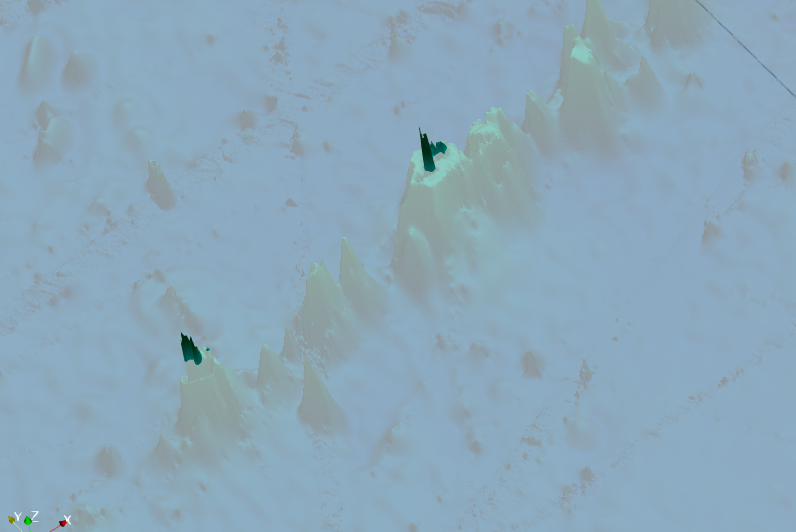
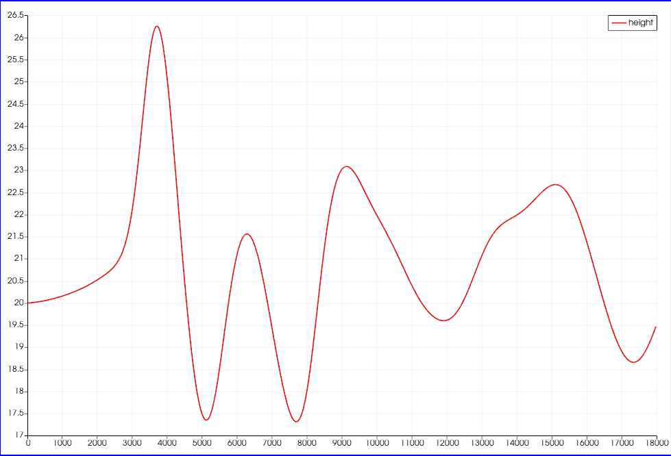
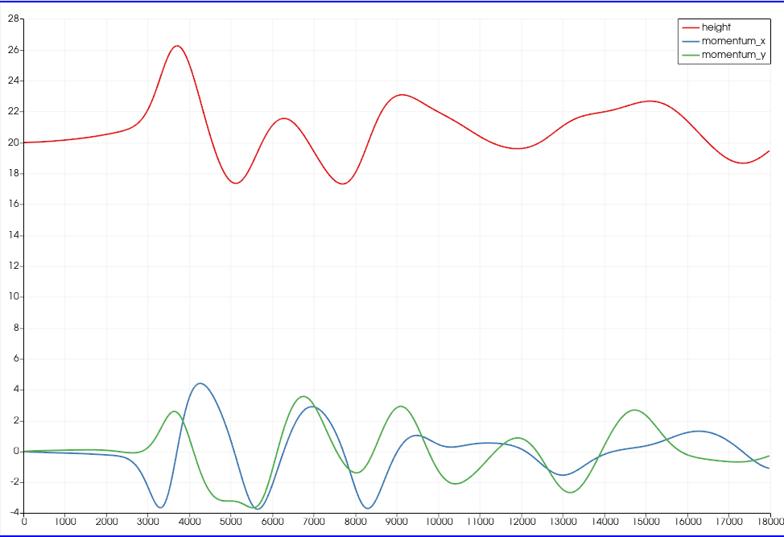

Tsunami Report 6 Tsunami Simulations
=============================================

Links
-----

`Github Repo <https://github.com/Minutenreis/tsunami_lab>`_

`User Doc <https://tsunami-lab.readthedocs.io/en/latest/>`_

Individual Contributions
------------------------

Justus Dreßler: all members contributed equally

Thorsten Kröhl: all members contributed equally

Julius Halank: all members contributed equally

6.1. 2010 M 8.8 Chile Event
---------------------------

6.1.1 Visualize the Input data
^^^^^^^^^^^^^^^^^^^^^^^^^^^^^^

  Bathymetry of the Chilean coast.

  Displacement of the 2010 M8.8 Chile Event.

6.1.2 Simulate the tsunami event and visualize the output
^^^^^^^^^^^^^^^^^^^^^^^^^^^^^^^^^^^^^^^^^^^^^^^^^^^^^^^^^

Disclaimer: Due to performance issues / time constraints the simultion was only run for 1000m and 500m resolutions. 
The Data for 250m Resolution is just extrapolated from the 500m Resolution (2x each dimension, 8x updates).

The computational demands for the simulations are approximated by the following table:

+------------------+------------------+------------------+------------------+
| Resolution       | 1000m (5h)       | 500m (5h)        | 250m (5h)        |
+==================+==================+==================+==================+
| Height (Cells)   | 2950             | 5900             | 11800            |
+------------------+------------------+------------------+------------------+
| Width (Cells)    | 3500             | 7000             | 14000            |
+------------------+------------------+------------------+------------------+
| Timesteps        | 11393            | 22793            | 45572            |
+------------------+------------------+------------------+------------------+
| Cellupdates      | 0.47 * 10^12     | 3.76 * 10^12     | 30.1 * 10^12     |
+------------------+------------------+------------------+------------------+

Cellupdates were calculated as :math:`Height \cdot Width \cdot Timesteps \cdot 4`.
(4 for the 4 directions in each update)

..
    todo: simulated time till first waves leave domain

..
    todo: check with simulation of Ara

.. video:: _static/6_chile_500_1h.mp4
   :width: 700

*Simulation of the 2010 M8.8 Chile Event with 500m Resolution for 1h.
The height of the waves is scaled by a factor of 20000 and the bathymetry is scaled by a factor of 20.*

We noticed our simulation breaking down near the end of the hour when the wave hit the stones sticking out of the ocean (see image below).
Our running theory is that the stones are to shallow in the water and the rarefaction wave following the shockwave reduces the waterheight to a very low value.
This causes the FWave solver to break down (specifically the :code:`t_real l_uL = i_huL / i_hL;` calculating the particle velocity).
that would explain the sudden explosion in height around these areas in the end.
One could probably fix this by increasing the :math:`\delta` value in the :code:`TsunamiEvent2d` setup, we didn't have time to test this.

  The problematic region in our simulation (500m Resolution).

..
    todo: simulation with 1000m resolution Julius

6.2 2011 M 9.1 Tohoku Event
---------------------------

6.2.1 Simulate the tsunami event and visualize the output
^^^^^^^^^^^^^^^^^^^^^^^^^^^^^^^^^^^^^^^^^^^^^^^^^^^^^^^^^

The computational demands for the simulations are approximated by the following table:

+------------------+------------------+------------------+------------------+
| Resolution       | 1000m (10h)      | 500m (5h)        | 250m (5h)        |
+==================+==================+==================+==================+
| Height (Cells)   | 1500             | 3000             | 6000             |
+------------------+------------------+------------------+------------------+
| Width (Cells)    | 2700             | 5400             | 10800            |
+------------------+------------------+------------------+------------------+
| Timesteps        | 24566            | 24617            | 45572            |
+------------------+------------------+------------------+------------------+
| Cellupdates      | 0.4 * 10^12      | 1.6 * 10^12      | 12.8 * 10^12     |
+------------------+------------------+------------------+------------------

We see the simulation is significantly faster than the Chile Event due to the smaller size.

The first wave leaves the computational domain after roughly 16500 seconds (4.5 hours).
(Tested in the 1000m 10h simulation and means we'll only simulate 5h in our 500m simulation)

.. video:: _static/6_Tohoku_1000_Sim_20_20000_water2d_topo.mp4
   :width: 700

*Simulation of the 2011 M9.1 Tohoku Event with 1000m Resolution for 10h.*

.. video:: _static/6_Tohoku_500_Sim_20_20000_water2d_topo.mp4
   :width: 700

*Simulation of the 2011 M9.1 Tohoku Event with 500m Resolution for 5h.*

Similarly to the Chile Event we also see the simulation breaking down in very shallow water regions (the light red regions in the following image).

  Bathymetry of the Tohoku coast.

Deep red are all regions above 0m, light red are all regions between 0m and -15m and white are all regions deeper than -15m.

The simulation interestingly only breaks down in a very small region on the coast and the error doesn't propagate (much) further (since the regions get treated as landmass after the breakdown).

  500m Simulation at t=2698s as the last timestep before the breakdown happens.

We see that the very shallow region currently has a deep negative waterheight (the deep blue) which we hypothize is the cause of the breakdown in the next frame.

  500m Simulation at t=2878s as the first timestep after the breakdown happens.

Interestingly it has very strict outlines and remains relatively contained as problem.

  500m Simulation at t=17990s as the last timestep.

We see the breakdown barely propagated outwards and seemingly didn't affect the rest of the simulation much at all.

6.2.2 Check simulation results in the town of Sõma
^^^^^^^^^^^^^^^^^^^^^^^^^^^^^^^^^^^^^^^^^^^^^^^^^^

Historic Data for Sõma is available by the `NOAA Database<https://www.ngdc.noaa.gov/hazel/view/hazards/tsunami/runup-more-info/19241>`_.

The NOAA Database lists a travel time of 9 minutes for the first wave to reach Sõma, which is significantly faster than our simulation.
We don't know what the NOAA's criteria is for the travel minutes so the difference might be due to that.
The Database also lists a maximum height of :math:`9.3m`.

With the linked data we tried to approximate the wavespeed of the first wave too.

First we averaged the bathymetry between the epicenter (0,0) and Sõma (-54.6km, -127.6km) to get a rough estimate of the average depth between the two points.
We got a value of :math:`-255.61418m`.
The height should be the additive inverse of this value, so :math:`255.61418m`.
With the provided formula the wavespeed would be :math:`\sqrt{9.80665 * 255.61418} = 50 \frac{m}{s}`.
Sõma lies :math:`\sqrt{54.6^2 + 127.6^2} = 138.8km` away from the epicenter.
So the wave takes :math:`\frac{138.8km}{50 \frac{m}{s}} = 2776s \approx 46min` to reach Sõma.

In our simulation we placed a station at (-55km, -123km) and measured h, hu and hv.
We used the coordinates to ensure us actually landing in the water in our simulation and not on a landmass.

  height at Sõma over 5h (500m resolution)

  height, momentum_x and momentum_y at Sõma over 5h (500m resolution)

We see that the first wave reaches Sõma at roughly :math:`2400s \approx 40min`, so slightly earlier than calculated.
This is likely a result of the calculation being from the epicenter to Sõma while the displacement extends nearer to Sõma.
Since both are pretty close too each other so we feel relatively confident in our simulation.

According to the simulation Sõma saw a maximum height of roughly :math:`5m`, which is significantly smaller than the measured :math:`9.3m` of NOAA which is likely explained by our station being 4km off of Sõmas coast.