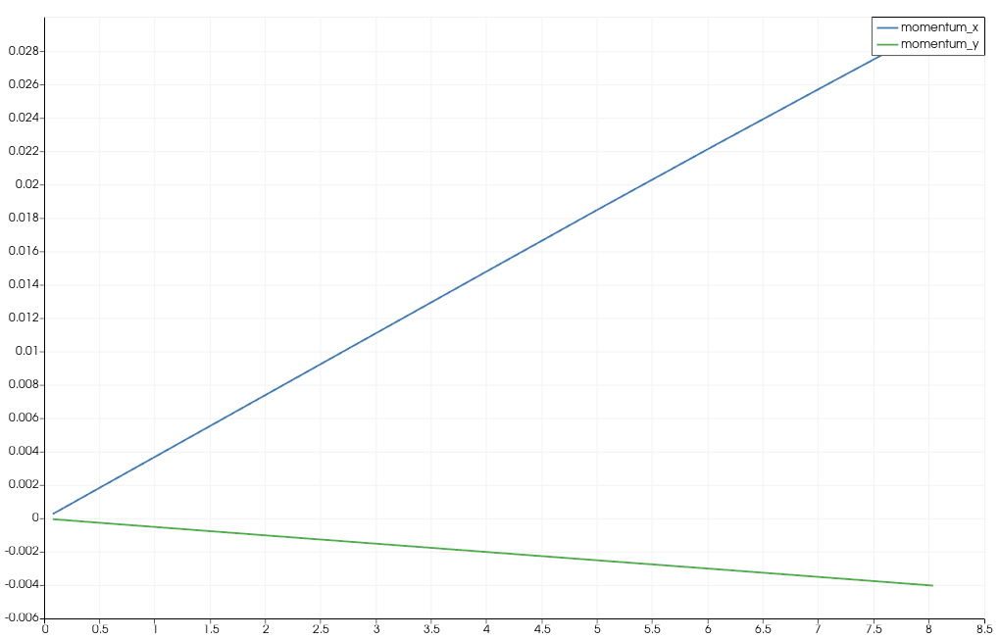

Tsunami Report 7 Checkpointing and Coarse Output
=============================================

Links
-----

`Github Repo <https://github.com/Minutenreis/tsunami_lab>`_

`User Doc <https://tsunami-lab.readthedocs.io/en/latest/>`_

Individual Contributions
------------------------

Justus Dreßler: all members contributed equally

Thorsten Kröhl: all members contributed equally

Julius Halank: all members contributed equally

7.1 Checkpointing
-----------------

7.1.1 Extend your netCDF writer
^^^^^^^^^^^^^^^^^^^^^^^^^^^^^^^

The required information for a restart are listed below. 
We write them analogously to the output file (text has its own dimension since we use :code:`NC_CHAR` instead of :code:`NC_STRING`).
For brevities sake we only show the code for the function signature.

.. code-block:: cpp

    void tsunami_lab::io::NetCdf::writeCheckpoint(t_idx i_nx,
                                                  t_idx i_ny,
                                                  t_idx i_stride,
                                                  t_idx i_ghostCellsX,
                                                  t_idx i_ghostCellsY,
                                                  bool i_useFWave,
                                                  tsunami_lab::t_boundary i_boundaryL,
                                                  tsunami_lab::t_boundary i_boundaryR,
                                                  tsunami_lab::t_boundary i_boundaryB,
                                                  tsunami_lab::t_boundary i_boundaryT,
                                                  tsunami_lab::t_real i_endTime,
                                                  tsunami_lab::t_real i_width,
                                                  tsunami_lab::t_real i_xOffset,
                                                  tsunami_lab::t_real i_yOffset,
                                                  tsunami_lab::t_real i_hMax,
                                                  std::string i_stationFilePath,
                                                  tsunami_lab::t_idx i_nFrames,
                                                  tsunami_lab::t_idx i_k,
                                                  tsunami_lab::t_idx i_timeStep,
                                                  tsunami_lab::t_idx i_nOut,
                                                  tsunami_lab::t_idx i_nFreqStation,
                                                  tsunami_lab::t_real i_simTime,
                                                  int i_maxHours,
                                                  const t_real *i_b,
                                                  const t_real *i_h,
                                                  const t_real *i_hu,
                                                  const t_real *i_hv)

It gets called at most once an hour and writes a checkpoint file to the :code:`checkpoints` directory.
It only writes after frame output to :code:`output.nc` so it has relatively up to date outputs
(One might argue that checkpointing should be done independently of outputs, still debating on this one).
The checkpoint file is named :code:`checkpoint_<ISO_DATE>.nc` where :code:`<ISO_DATE>` is the current date and time in ISO_8601 Format to simplify sorting by time later.
We finally check whether we have more than 3 checkpoints and delete the oldest one if we do (we only need 2 checkpoints for redundancy should one fail while writing).

.. code-block:: cpp

     else if (l_ny > 1 && l_useNetCdf && l_elapsed >= std::chrono::hours(l_nOutCheckpoint))
      {
        std::cout << "  writing checkpoint" << std::endl;
        tsunami_lab::io::NetCdf::writeCheckpoint(/*INPUTS*/); // inputs removed for brevity
        ++l_nOutCheckpoint;

        // delete oldest checkpoint if at least 3 exist
        std::vector<std::string> l_checkpoints = {};
        for (const auto &entry : std::filesystem::directory_iterator("checkpoints"))
        {
          l_checkpoints.push_back(entry.path());
        }
        std::sort(l_checkpoints.begin(), l_checkpoints.end());
        if (l_checkpoints.size() > 2)
        {
          std::filesystem::remove(l_checkpoints.front()); // smallest = oldest
        }
        auto l_checkpointEnd = std::chrono::high_resolution_clock::now();
        l_duration_checkpoint += l_checkpointEnd - l_WriteEnd;
      }

7.1.2 & 7.1.4 Loading the Checkpoint
^^^^^^^^^^^^^^^^^^^^^^^^^^^^^^^^^^^^

We check whether a checkpoint file exists (checkpoints directory not empty) and load it if it does exist.
If it does, we load it instead of reading the input parameters from the command line.
For technical reasons :code:`l_nx` still has to be set in the input parameters but it won't get read.
If we find at least one checkpoint we iterate over all checkpoints (it should be at max 3) and load the newest one.
We can do this because the checkpoints are named :code:`checkpoint_<ISO_DATE>.nc` so we can simply alphanumerically sort them.
After we read the checkpoint and set up the :code:`solver`, :code:`WavePropagation2d` and :code:`stations` we read in the saved :code:`l_h`, :code:`l_hu`, :code:`l_hv` and :code:`l_b` into :code:`WavePropagation2d` directly.
Then we delete all newer station outputs because we don't want to have duplicate entries in the station files.
We might consider reading in an optional parameter to change the :code:`l_endTime` of the simulation when loading a checkpoint in the future.

.. code-block:: cpp

    if (std::filesystem::exists("checkpoints") && std::filesystem::is_directory("checkpoints") && !std::filesystem::is_empty("checkpoints"))
  {
    l_useCheckpoint = true;

    // find newest checkpoint
    std::vector<std::string> l_checkpoints = {};
    for (const auto &entry : std::filesystem::directory_iterator("checkpoints"))
    {
      l_checkpoints.push_back(entry.path());
    }
    std::sort(l_checkpoints.begin(), l_checkpoints.end());
    std::string l_newestCheckpoint = l_checkpoints.back();

    // load checkpoint
    std::cout << "  loading checkpoint " << l_newestCheckpoint << std::endl;

    tsunami_lab::t_real *l_b = nullptr;
    tsunami_lab::t_real *l_h = nullptr;
    tsunami_lab::t_real *l_hu = nullptr;
    tsunami_lab::t_real *l_hv = nullptr;
    std::string l_stationFilePath = "";

    tsunami_lab::io::NetCdf::readCheckpoint(l_newestCheckpoint.data(),
                                            &l_nx,
                                            &l_ny,
                                            &l_useFwave,
                                            &l_boundaryL,
                                            &l_boundaryR,
                                            &l_boundaryB,
                                            &l_boundaryT,
                                            &l_endTime,
                                            &l_width,
                                            &l_xOffset,
                                            &l_yOffset,
                                            &l_hMax,
                                            &l_stationFilePath,
                                            &l_nFrames,
                                            &l_k,
                                            &l_timeStep,
                                            &l_nOut,
                                            &l_nFreqStation,
                                            &l_simTime,
                                            &l_maxHours,
                                            &l_b,
                                            &l_h,
                                            &l_hu,
                                            &l_hv);

    // always netCdf 2D output
    l_writer = new tsunami_lab::io::NetCdf();
    l_waveProp = new tsunami_lab::patches::WavePropagation2d(l_nx, l_ny, l_useFwave, l_boundaryL, l_boundaryR, l_boundaryB, l_boundaryT);
    l_stations = new tsunami_lab::io::Stations(l_stationFilePath);

    // set up solver
    for (tsunami_lab::t_idx l_cy = 0; l_cy < l_ny; l_cy++)
      for (tsunami_lab::t_idx l_cx = 0; l_cx < l_nx; l_cx++)
      {
        l_waveProp->setHeight(l_cx,
                              l_cy,
                              l_h[l_cx + l_cy * l_nx]);

        l_waveProp->setMomentumX(l_cx,
                                 l_cy,
                                 l_hu[l_cx + l_cy * l_nx]);

        l_waveProp->setMomentumY(l_cx,
                                 l_cy,
                                 l_hv[l_cx + l_cy * l_nx]);

        l_waveProp->setBathymetry(l_cx,
                                  l_cy,
                                  l_b[l_cx + l_cy * l_nx]);
      }

    // delete all newer station outputs
    if (std::filesystem::exists("stations"))
    {
      rapidcsv::Document l_doc;
      for (const auto &entry : std::filesystem::directory_iterator("stations"))
      {
        std::string l_filePath{entry.path().u8string()};
        tsunami_lab::io::Csv::openCSV(l_filePath, l_doc, true);
        int l_rows = l_doc.GetRowCount();
        for (int i = l_rows - 1; i >= 0; --i)
        {
          if (l_doc.GetCell<tsunami_lab::t_real>(0, i) > l_simTime)
            l_doc.RemoveRow(i);
          else
            break;
        }
        l_doc.Save();
      }
    }

    delete[] l_b;
    delete[] l_h;
    delete[] l_hu;
    delete[] l_hv;
  }

7.1.3 Test your checkpointing
^^^^^^^^^^^^^^^^^^^^^^^^^^^^^

We tested our Checkpointing by temporarily setting the checkpointing interval to 1 minute and killing it off repeatedly.
We also wrote unit tests to ensure that the data written to and read from the checkpoints is the same.
We might consider using more "newer" variable types for checkpointing in the future (e.g. :code:`NC_STRING`, :code:`NC_UINT`), we didn't initially to support our old NetCdf format.
It turned out NetCdf Classic doesn't support large fixed length arrays so we had to pivot into NetCdf4 anyway.

7.2 Coarse Output
-----------------

7.2.1 Modify the output writers 
^^^^^^^^^^^^^^^^^^^^^^^^^^^^^^^

We added a new parameter :code:`[-k size]` to the command line arguments.
This parameter determines how many input cells are combined into one output cell.
We average :math:`k \cdot k` input cells into one output cell by iterating over the input cells and adding their value devided by :math:`k^2` to the respective output cell.
In our :code:`NetCdf::putVaraWithGhostcells` function we now first combine k rows of input cells into a single row of output cells.
(We are using rows instead of putting individual cells to lessen the load on the NetCdf library).
We then write the output row to the output file.
The parameter :code:`i_hasTime` determines whether or not the time dimension gets put in as dimension so we can use the same function for all of :code:`i_h`, :code:`i_hu`, :code:`i_hv` and :code:`i_b`.
We ignore the overstanding cells at the right and top border of the domain (example: 5x5 grid with k=2 has 1 overstanding cell in x and y direction).
This is also the cause for the maybe bit unintuitive code :code:`t_idx l_sizeX = (m_nx / m_k) * m_k;`.
Since both :code:`m_nx` and :code:`m_k` are integers, the division :code:`m_nx / m_k` is also an integer division and represents :code:`floor(m_nx / m_k)`.
We then multiply this by :code:`m_k` to get the number of cells that are not overstanding in the x direction (example: 5x5 grid with k=2: :code:`(5/2)*2=2*2=4`).

.. code-block:: cpp

    void tsunami_lab::io::NetCdf::putVaraWithGhostcells(t_real const *i_data, int i_var, t_idx i_nOut, bool i_hasTime)
    {
    t_idx l_time = i_hasTime ? 0 : 1; // if it has no time, start array at 1st index
    t_idx start_p[3] = {i_nOut, 0, 0};
    t_idx count_p[3] = {1, 1, m_nx / m_k};
    t_idx l_sizeX = (m_nx / m_k) * m_k; // m_nx/k*k (integer division) => ignores the overstanding cells at the right border
    for (start_p[1] = 0; start_p[1] < m_ny / m_k; ++start_p[1])
    {
        // zero initialised array for averaged data
        t_real *l_row = new t_real[m_nx / m_k]{};
        for (t_idx l_iy = start_p[1] * m_k; l_iy < (start_p[1] + 1) * m_k; ++l_iy)
        {
            for (t_idx l_ix = 0; l_ix < l_sizeX; ++l_ix)
            {
                l_row[l_ix / m_k] += i_data[l_ix + m_ghostCellsX + (l_iy + m_ghostCellsY) * m_stride] / (m_k * m_k);
            }
        }
        ncCheck(nc_put_vara_float(m_ncidp, i_var, start_p + l_time, count_p + l_time, l_row), __FILE__, __LINE__);
        delete[] l_row;
    }
    }

7.2.2  Simulate March 11, 2011, M 9.1 Tohoku earthquake 50m
^^^^^^^^^^^^^^^^^^^^^^^^^^^^^^^^^^^^^^^^^^^^^^^^^^^^^^^^^^^

We simulated the Tohoku earthquake with a grid size of 50m and a coarseness of 5 for 10 seconds of simulation time with 1 frame per second.
(The Simulation took roughly 10h 30min on an Ara Node and didn't finish the tenth second output, so we only have up to 8.5454).

Our simulation results are shown below:

   Sõma's momenta over the first 8 seconds (there was no discernible difference for the height).

.. video:: _static/7_Tohoku_50m_k5_9s.mp4
   :width: 700

*Simulation of the Tohoku earthquake with 50m grid size and 5x5 coarseness for 9 seconds.*

.. code-block:: bash

    ####################################
    ### Tsunami Lab                  ###
    ###                              ###
    ### https://scalable.uni-jena.de ###
    ####################################
    runtime configuration
      using Tsunami2d(tohoku_gebco20_ucsb3_50m_displ.nc,tohoku_gebco20_ucsb3_50m_bath.nc,10) setup
      using NetCDF output
      using stations file at src/data/stations.json
      using 2d solver
      using FWave solver
      cell size:                      50 m
      frames output:                  10
      width simulated:                2.69995e+06 m
      coordinates simulated:          x e [-199975, 2.49998e+06]
                                      y e [-749975, 749975]
      time simulated:                 10 s
      number of cells in x-direction: 53999
      number of cells in y-direction: 29999
      using coarse output (netcdf):   5x5 cells
      time step:                      0.0730376 s
      number of time steps:           137
      number of time steps per frame: 13
      time per frame (approx.):       0.949489 s
      maximum runtime:                10 h
    entering time loop
      simulation time / #time steps: 0 / 0
      simulation time / #time steps: 0.949489 / 13
      writing checkpoint
      simulation time / #time steps: 1.89898 / 26
      writing checkpoint
      simulation time / #time steps: 2.84847 / 39
      writing checkpoint
      simulation time / #time steps: 3.79796 / 52
      writing checkpoint
      simulation time / #time steps: 4.74745 / 65
      writing checkpoint
      simulation time / #time steps: 5.69693 / 78
      writing checkpoint
      simulation time / #time steps: 6.64642 / 91
      writing checkpoint
      simulation time / #time steps: 7.59591 / 104
      writing checkpoint
      simulation time / #time steps: 8.5454 / 117
      maximum time exceeded, exiting
    finished time loop
    total time: 10h 29min 41s 389ms
    setup time: 2min 22s 848ms
    calc time : 9h 27min 56s 489ms
    write time: 46min 58s 463ms
    checkpoint time: 12min 23s 587ms
    freeing memory
    deleting checkpoints
    finished, exiting

*Our programs output over the course of the simulation.*

Interesting to us was that the time to write the checkpoints was wastly less than the time to write the frames, 
despite the frames in total being about 9 GB while each checkpoint was about 25 GB of data.
Apperantly averaging the 5x5 cells takes a much larger toll than we expected (we assumed the file-io to be more taxing).
Despite both of those things the vast majority of our time (90.2%) is still spent calculating the netupdates in our simulation.
This should be our first priority for optimization in the future.