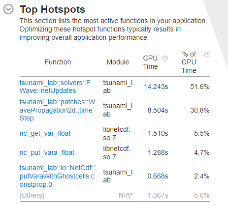
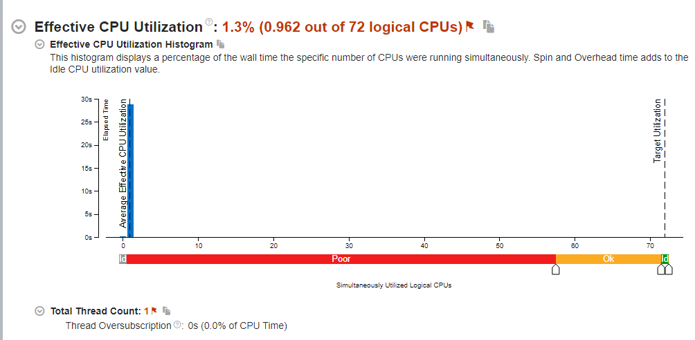

8 Optimization
=================

Links
-----

`Github Repo <https://github.com/Minutenreis/tsunami_lab>`_

`User Doc <https://tsunami-lab.readthedocs.io/en/latest/>`_

Individual Contributions
------------------------

Justus Dreßler: all members contributed equally

Thorsten Kröhl: all members contributed equally

Julius Halank: all members contributed equally

8.1 ARA
-------------

8.1.1 Upload and Compile Code on Cluster
^^^^^^^^^^^^^^^^^^^^^^^^^^^^^^^^^^^^^^^^^

We uploaded our code via :code:`git clone` and :code:`wget` the :code:`tar.xz` file from the uni-cloud.
We then untarred the file and ran the following batch script to compile the code:

.. code-block:: shell

    #!/bin/bash
    #SBATCH --job-name=tsunami_lab_reis
    #SBATCH --output=tsunami_lab_reis.output
    #SBATCH --error=tsunami_lab_reis.err
    #SBATCH --partition=s_hadoop,s_standard
    #SBATCH --nodes=1
    #SBATCH --ntasks=1
    #SBATCH --time=11:00:00
    #SBATCH --cpus-per-task=72

    # Load any necessary modules (if needed)
    # module load mymodule
    module load tools/python/3.8
    module load compiler/gcc/11.2.0
    module load compiler/intel/2020-Update2
    python3.8 -m pip install --user scons
    python3.8 -m pip install --user distro

    # Enter your executable commands here
    # Execute the compiled program
    date
    cd /beegfs/gi24ken/tsunami_lab
    scons comp=icpc
    ./build/tsunami_lab -i -t 10 -u "Tsunami2d output/tohoku_gebco20_usgs_250m_displ.nc output/tohoku_gebco20_usgs_250m_bath.nc 18000" 4000

8.1.2 Run different scenarious and batch jobs
^^^^^^^^^^^^^^^^^^^^^^^^^^^^^^^^^^^^^^^^^^^^^

We already ran Chapter 6 50/50 on Ara and on our home PC's and didn't see any difference in output quality.

8.1.3 Compare time consumption to your local pc and add a timer for each steps
^^^^^^^^^^^^^^^^^^^^^^^^^^^^^^^^^^^^^^^^^^^^^^^^^^^^^^^^^^^^^^^^^^^^^^^^^^^^^^

All configurations were run with :code:`./build/tsunami_lab -i -t 10 -u "Tsunami2d output/tohoku_gebco20_usgs_250m_displ.nc output/tohoku_gebco20_usgs_250m_bath.nc 18000" 4000`.
(Tohoku, 4000m Cellsize, no FileIO)

Methodology: We ran the program 3 times and took the average of the 3 runs.

Ara: Skylake Intel(R) Xeon(R) Gold 6140 CPU @ 2.30GHz

+---------------------------------------------------------------+-----------------------------+
| Configuration                                                 | Time per Cell and Iteration |
+===============================================================+=============================+
| g++ -Ofast -g -march=native -mtune=native after optimizations | 28.0ns                      |
+---------------------------------------------------------------+-----------------------------+
| g++ -Ofast -g -march=native -mtune=native                     | 43.3ns                      |
+---------------------------------------------------------------+-----------------------------+
| g++ -Ofast -g                                                 | 48.3ns                      |
+---------------------------------------------------------------+-----------------------------+
| g++ -O3 -g                                                    | 51.0ns                      |
+---------------------------------------------------------------+-----------------------------+
| g++ -O2 -g                                                    | 54.3ns                      |
+---------------------------------------------------------------+-----------------------------+
| g++ -O1 -g                                                    | 73.0ns                      |
+---------------------------------------------------------------+-----------------------------+
| g++ -O0 -g                                                    | 172.3ns                     |
+---------------------------------------------------------------+-----------------------------+

Home-PC Justus Dreßler: Coffee Lake Intel(R) Core(TM) i5-8600K CPU @ 3.60GHz
Disclaimer: We commented out code involving :code:`std::filesystem::directory_iterator` because icpc seems to not handle its library.
The code shouldn't be touched in the runtime (disabled fileIO) but it may result in a smaller binary.

+---------------------------------------------------------------+-----------------------------+
| Configuration                                                 | Time per Cell and Iteration |
+===============================================================+=============================+
| g++ -Ofast -g -march=native -mtune=native after optimizations | 25.0ns                      |
+---------------------------------------------------------------+-----------------------------+
| g++ -Ofast -g -march=native -mtune=native                     | 39.3ns                      |
+---------------------------------------------------------------+-----------------------------+
| icpc -Ofast -g -march=native -mtune=coffeelake                | 41.3ns                      |
+---------------------------------------------------------------+-----------------------------+
| icpc -Ofast -g -march=native -mtune=coffeelake -ipo           | 41.7ns                      |
+---------------------------------------------------------------+-----------------------------+
| g++ -O3 -g -march=native -mtune=native                        | 43.3ns                      |
+---------------------------------------------------------------+-----------------------------+
| g++ -Ofast -g                                                 | 44.3ns                      |
+---------------------------------------------------------------+-----------------------------+
| icpc -O3 -g                                                   | 44.7ns                      |
+---------------------------------------------------------------+-----------------------------+
| icpc -Ofast -g                                                | 45.0ns                      |
+---------------------------------------------------------------+-----------------------------+
| icpc -O2 -g                                                   | 47.3ns                      |
+---------------------------------------------------------------+-----------------------------+
| g++ -O3 -g                                                    | 47.3ns                      |
+---------------------------------------------------------------+-----------------------------+
| g++ -O2 -g                                                    | 49.0ns                      |
+---------------------------------------------------------------+-----------------------------+
| g++ -O1 -g                                                    | 66.3ns                      |
+---------------------------------------------------------------+-----------------------------+
| icpc -O1 -g                                                   | 72.7ns                      |
+---------------------------------------------------------------+-----------------------------+
| g++ -O0 -g                                                    | 153.0ns                     |
+---------------------------------------------------------------+-----------------------------+
| icpc -O0 -g                                                   | 208.3ns                     |
+---------------------------------------------------------------+-----------------------------+

Ara seems to be roughly 10% slower than Justus Dreßler's home PC i5-8600K (without background programs running).

8.2 Compiler
-------------

8.2.1 Add support for generic compilers to your build script
^^^^^^^^^^^^^^^^^^^^^^^^^^^^^^^^^^^^^^^^^^^^^^^^^^^^^^^^^^^^

..
    todo: maybe leak environ into scons script for this? don't like it though

We currently don't leak the build environment into the scons script. 
(It seems to be discouraged by the SCons developers.)
Instead we use the arguments :code:`comp=g++` / :code:`comp=icpc` and :code:`cxxO=-OX` to set the compiler and optimization level.
This does impose limitations on the compiler since SCons doesn't look into the path but searches itself, so we need to provide the exact install locations.
So we currently only support :code:`icpc` and :code:`g++`.

.. code-block:: python

    # set compiler
    cxxCompiler = ARGUMENTS.get('comp', "g++")

    # workaround to find the right g++ version on Ara
    if 'centos' == distro.id():
      if cxxCompiler == 'g++':
        print('running on Ara, using gcc-11.2.0')
        env.Replace(CXX="/cluster/spack/opt/spack/linux-centos7-broadwell/gcc-10.2.0/gcc-11.2.0-c27urtyjryzoyyqfms5m3ewi6vrtvt44/bin/g++")
      else:    
        print('running on Ara, using icpc-19.1.2.254')
        env.Replace(CXX="/cluster/intel/parallel_studio_xe_2020.2.108/compilers_and_libraries_2020/linux/bin/intel64/icpc")
    else:
      if cxxCompiler == 'g++':
        pass
      else:
        env.Replace(CXX="icpc")

    # add default flags
    env.Append( CXXFLAGS = [ '-std=c++17',
                               '-Wall',
                               '-Wextra',
                               '-g',
                               '-march=native',
                               '-mtune=native',
                               '-Werror',])
    if( 'g++' == cxxCompiler ):
      env.Append( CXXFLAGS = [ '-Wpedantic' ] )
    else:
      env.Append( CXXFLAGS = ['-diag-disable=10441',
                               '-wd823'])

    # set optimization mode
    if 'debug' in env['mode']:
      env.Append( CXXFLAGS = [ '-g',
                               '-O0' ] )
      print( 'using optimization flag: -O0 -g' )
    else:
      cxxOptimization = ARGUMENTS.get('cxxO', "-O3")
      env.Append( CXXFLAGS = [ cxxOptimization ] )
      print( 'using optimization flag: ' + cxxOptimization )

8.2.2 & 8.2.3 Compare recent GNU and Intel compilers
^^^^^^^^^^^^^^^^^^^^^^^^^^^^^^^^^^^^^^^^^^^^^^^^^^^^

We used :code:`g++ Version 11.2.0` and :code:`icpc Version 19.1.2` on Ara and :code:`g++ Version 11.4.0` and :code:`icpc Version 2021.10.0 (Intel OneApi)` on our home PC's.	
See `8.1.3 Compare time consumption to your local pc and add a timer for each steps`_ for the results.

The results for each compiler are as expected (higher optimization level = faster code).
The :code:`-ipo` flag for icpc didn't seem to have any effect on the runtime.
If we compare both compilers between each other icpc seemed genereally slightly faster than g++ except on the highest optimization level.
With :code:`-Ofast -g -march=native -mtune=native` :code:`g++` beat out :code:`icpc` by a solid 5%.
:code:`g++` also won in the compatibility of the code, as :code:`icpc` for some reason couldn't link to :code:`std::filesystem::directory_iterator` and we had to comment out the code involving it.
This is probably caused by :code:`icpc` using :code:`g++`'s standard library and not shipping with its own.

For the following abstract we used `GCC's Docs on Optimization <https://gcc.gnu.org/onlinedocs/gcc/Optimize-Options.html>`_.
Regarding numerical accuracy the only problematic flag should be (disregarding compiler bugs) :code:`-Ofast` since it turns on :code:`-ffast-math` and :code:`-fallow-store-data-races`.

:code:`-ffast-math` turns on :code:`-fno-math-errno`, :code:`-funsafe-math-optimizations` , :code:`-ffinite-math-only`, :code:`-fno-rounding-math`, :code:`-fno-signaling-nans`, :code:`-fcx-limited-range` and :code:`-fexcess-precision=fast`.	

* :code:`-fno-math-errno` should be numerically safe for our program as we don't read out :code:`errno` at any point.
* :code:`-funsafe-math-optimizations` is a potential hazard regarding numerical accuracy as it turns on :code:`-fno-signed-zeros`, :code:`-fno-trapping-math`, :code:`-fassociative-math`` and :code:`-freciprocal-math`.
  
  * :code:`-fno-signed-zeros` should be harmless as we shouldn't rely on the sign of :code:`0.0` at any point of the code.
  * :code:`-fno-trapping-math` should be harmless as long as we test the code before without it as there shouldn't be any traps thrown while running.
  * :code:`-fassociative-math` is a potential hazard as floating-point math is naturally not associative and it could change the numeric stability of our operations potentially.
  * :code:`-freciprocal-math` is a potential hazard as it lowers the accuracy of some divide operations.

* :code:`-ffinite-math-only` should be harmless since the results should at no point be NaN nor +-inf.
* :code:`-fno-rounding-math` is the default and shouldn't affect anything (we don't change our rounding mode dynamically).
* :code:`-fno-signaling-nans` is the default and shouldn't affect anything.
* :code:`-fcx-limited-range` should be harmless since we don't use complex arithmetic.
* :code:`-fexcess-precision=fast` is a minor potential hazard as it changes rounding behavior if higher precision math is faster on some operations.

:code:`-fallow-store-data-races` should be harmless since we currently aren't using multiple threads so no races should be able to occur.

8.2.4 Make yourself familiar with optimization reports and add an option for them in your build script
^^^^^^^^^^^^^^^^^^^^^^^^^^^^^^^^^^^^^^^^^^^^^^^^^^^^^^^^^^^^^^^^^^^^^^^^^^^^^^^^^^^^^^^^^^^^^^^^^^^^^^

The optimization reports of :code:`icpc -O3 -g` show that the :code:`FWave::netUpdates()` is fully inlined (except memsets) but its not inlined into :code:`WavePropagation2d::timeStep()`.

.. code:: cpp

  INLINE REPORT: (tsunami_lab::solvers::FWave::netUpdates(tsunami_lab::t_real, tsunami_lab::t_real, tsunami_lab::t_real, tsunami_lab::t_real, tsunami_lab::t_real, tsunami_lab::t_real, tsunami_lab::t_real *, tsunami_lab::t_real *)) [5/6=83.3%] build/src/solvers/fWave/FWave.cpp(105,1)
  -> INLINE: (140,5) tsunami_lab::solvers::FWave::waveSpeeds(tsunami_lab::t_real, tsunami_lab::t_real, tsunami_lab::t_real, tsunami_lab::t_real, tsunami_lab::t_real &, tsunami_lab::t_real &) (isz = 22) (sz = 37)
    -> INLINE (MANUAL): (20,23) std::sqrt(float) (isz = 0) (sz = 7)
    -> INLINE (MANUAL): (21,23) std::sqrt(float) (isz = 0) (sz = 7)
    -> INLINE (MANUAL): (29,36) std::sqrt(float) (isz = 0) (sz = 7)
  -> INLINE: (151,5) tsunami_lab::solvers::FWave::waveStrengths(tsunami_lab::t_real, tsunami_lab::t_real, tsunami_lab::t_real, tsunami_lab::t_real, tsunami_lab::t_real, tsunami_lab::t_real, tsunami_lab::t_real, tsunami_lab::t_real, tsunami_lab::t_real &, tsunami_lab::t_real &) (isz = 77) (sz = 100)
    -> EXTERN: (68,25) ?1memset
    -> INLINE: (81,5) tsunami_lab::solvers::FWave::flux(tsunami_lab::t_real, tsunami_lab::t_real, tsunami_lab::t_real &, tsunami_lab::t_real &) (isz = 4) (sz = 15)
    -> INLINE: (82,5) tsunami_lab::solvers::FWave::flux(tsunami_lab::t_real, tsunami_lab::t_real, tsunami_lab::t_real &, tsunami_lab::t_real &) (isz = 4) (sz = 15)
    -> INLINE: (83,5) tsunami_lab::solvers::FWave::deltaXPsi(tsunami_lab::t_real, tsunami_lab::t_real, tsunami_lab::t_real, tsunami_lab::t_real, tsunami_lab::t_real &) (isz = 1) (sz = 14)
  -> EXTERN: (163,23) ?1memset
  -> EXTERN: (164,23) ?1memset

Optimization Report of :code:`FWave::netUpdates()`

.. code:: cpp

  INLINE REPORT: (tsunami_lab::patches::WavePropagation2d::timeStep(tsunami_lab::patches::WavePropagation2d *, tsunami_lab::t_real)) [13/24=54.2%] build/src/patches/wavePropagation2d/WavePropagation2d.cpp(56,1)
  -> INLINE: (57,3) tsunami_lab::patches::WavePropagation2d::setGhostCellsX(tsunami_lab::patches::WavePropagation2d *) (isz = 297) (sz = 302)
    -> INLINE: (185,11) tsunami_lab::patches::WavePropagation2d::getCoord(tsunami_lab::patches::WavePropagation2d *, tsunami_lab::t_idx, tsunami_lab::t_idx) (isz = 1) (sz = 11)
    /* more getCoord inlines */
    -> INLINE: (222,11) tsunami_lab::patches::WavePropagation2d::getCoord(tsunami_lab::patches::WavePropagation2d *, tsunami_lab::t_idx, tsunami_lab::t_idx) (isz = 1) (sz = 11)
  -> INLINE: (70,14) tsunami_lab::patches::WavePropagation2d::getCoord(tsunami_lab::patches::WavePropagation2d *, tsunami_lab::t_idx, tsunami_lab::t_idx) (isz = 1) (sz = 11)
  /* more getCoord inlines */
  -> INLINE: (80,21) tsunami_lab::patches::WavePropagation2d::getCoord(tsunami_lab::patches::WavePropagation2d *, tsunami_lab::t_idx, tsunami_lab::t_idx) (isz = 1) (sz = 11)
  -> EXTERN: (87,9) tsunami_lab::solvers::FWave::netUpdates(tsunami_lab::t_real, tsunami_lab::t_real, tsunami_lab::t_real, tsunami_lab::t_real, tsunami_lab::t_real, tsunami_lab::t_real, tsunami_lab::t_real *, tsunami_lab::t_real *)
  -> EXTERN: (98,9) tsunami_lab::solvers::Roe::netUpdates(tsunami_lab::t_real, tsunami_lab::t_real, tsunami_lab::t_real, tsunami_lab::t_real, tsunami_lab::t_real *, tsunami_lab::t_real *)
  -> INLINE: (114,3) tsunami_lab::patches::WavePropagation2d::setGhostCellsY(tsunami_lab::patches::WavePropagation2d *) (isz = 297) (sz = 302)
    -> INLINE: (242,11) tsunami_lab::patches::WavePropagation2d::getCoord(tsunami_lab::patches::WavePropagation2d *, tsunami_lab::t_idx, tsunami_lab::t_idx) (isz = 1) (sz = 11)
    /* more getCoord inlines */
    -> INLINE: (279,11) tsunami_lab::patches::WavePropagation2d::getCoord(tsunami_lab::patches::WavePropagation2d *, tsunami_lab::t_idx, tsunami_lab::t_idx) (isz = 1) (sz = 11)
  -> INLINE: (127,14) tsunami_lab::patches::WavePropagation2d::getCoord(tsunami_lab::patches::WavePropagation2d *, tsunami_lab::t_idx, tsunami_lab::t_idx) (isz = 1) (sz = 11)
  /* more getCoord inlines */
  -> INLINE: (137,21) tsunami_lab::patches::WavePropagation2d::getCoord(tsunami_lab::patches::WavePropagation2d *, tsunami_lab::t_idx, tsunami_lab::t_idx) (isz = 1) (sz = 11)
  -> EXTERN: (144,9) tsunami_lab::solvers::FWave::netUpdates(tsunami_lab::t_real, tsunami_lab::t_real, tsunami_lab::t_real, tsunami_lab::t_real, tsunami_lab::t_real, tsunami_lab::t_real, tsunami_lab::t_real *, tsunami_lab::t_real *)
  -> EXTERN: (155,9) tsunami_lab::solvers::Roe::netUpdates(tsunami_lab::t_real, tsunami_lab::t_real, tsunami_lab::t_real, tsunami_lab::t_real, tsunami_lab::t_real *, tsunami_lab::t_real *)

Currently our big loops in :code:`WavePropagation2d::timeStep()` are not vectorized and its not quite clear how we'd inline them with :code:`FWave::netUpdates()` being called in it.

.. code:: cpp

  LOOP BEGIN at build/src/patches/wavePropagation2d/WavePropagation2d.cpp(75,3)
    remark #15523: loop was not vectorized: loop control variable l_ex was found, but loop iteration count cannot be computed before executing the loop

    LOOP BEGIN at build/src/patches/wavePropagation2d/WavePropagation2d.cpp(76,5)
      remark #15523: loop was not vectorized: loop control variable l_ey was found, but loop iteration count cannot be computed before executing the loop
      remark #25456: Number of Array Refs Scalar Replaced In Loop: 1
    LOOP END
  LOOP END

We were able to vectorize the simple copying loops though with :code:`#pragma omp simd`.

.. code:: cpp

  // init new cell quantities
  #pragma omp simd
  for (t_idx l_cx = 1; l_cx < m_nCellsx + 1; l_cx++)
    for (t_idx l_cy = 1; l_cy < m_nCellsy + 1; l_cy++)
    {
      l_hNew[getCoord(l_cx, l_cy)] = l_hOld[getCoord(l_cx, l_cy)];
      l_huOld[getCoord(l_cx, l_cy)] = l_huNew[getCoord(l_cx, l_cy)]; // the real old data is in the hu_new
    }

Which shows up correctly in the optimization report:

.. code:: cpp

  LOOP BEGIN at build/src/patches/wavePropagation2d/WavePropagation2d.cpp(67,3)
    remark #15389: vectorization support: reference l_hNew[U19_V+1+l_cy*(this->m_nCellsx+2)] has unaligned access   [ build/src/patches/wavePropagation2d/WavePropagation2d.cpp(70,7) ]
    remark #15389: vectorization support: reference l_hOld[U19_V+1+l_cy*(this->m_nCellsx+2)] has unaligned access   [ build/src/patches/wavePropagation2d/WavePropagation2d.cpp(70,38) ]
    remark #15389: vectorization support: reference l_huOld[U19_V+1+l_cy*(this->m_nCellsx+2)] has unaligned access   [ build/src/patches/wavePropagation2d/WavePropagation2d.cpp(71,7) ]
    remark #15389: vectorization support: reference l_huNew[U19_V+1+l_cy*(this->m_nCellsx+2)] has unaligned access   [ build/src/patches/wavePropagation2d/WavePropagation2d.cpp(71,39) ]
    remark #15381: vectorization support: unaligned access used inside loop body
    remark #15305: vectorization support: vector length 8
    remark #15309: vectorization support: normalized vectorization overhead 0.923
    remark #15301: SIMD LOOP WAS VECTORIZED
    remark #15450: unmasked unaligned unit stride loads: 2 
    remark #15451: unmasked unaligned unit stride stores: 2 
    remark #15475: --- begin vector cost summary ---
    remark #15476: scalar cost: 9 
    remark #15477: vector cost: 1.620 
    remark #15478: estimated potential speedup: 5.100 
    remark #15488: --- end vector cost summary ---

    LOOP BEGIN at build/src/patches/wavePropagation2d/WavePropagation2d.cpp(68,5)
      remark #15548: loop was vectorized along with the outer loop
    LOOP END
  LOOP END

We are currently unsure why it assumes the arrays have unaligned access.

8.3 Instrumentation and Performance Counters
--------------------------------------------

8.3.1-8.3.3 Analyze your code with VTune
^^^^^^^^^^^^^^^^^^^^^^^^^^^^^^^^^^^^^^^^

The GUI produced the following commands for :code:`vtune`:

.. code:: shell

  # for threading
  /cluster/intel/vtune_profiler_2020.2.0.610396/bin64/vtune -collect threading -app-working-dir /beegfs/gi24ken/tsunami_lab -- /beegfs/gi24ken/tsunami_lab/build/tsunami_lab -t 10 -u "Tsunami2d output/tohoku_gebco20_usgs_250m_displ.nc output/tohoku_gebco20_usgs_250m_bath.nc 18000" 4000
  # for hotspots
  /cluster/intel/vtune_profiler_2020.2.0.610396/bin64/vtune -collect hotspots -app-working-dir /beegfs/gi24ken/tsunami_lab -- /beegfs/gi24ken/tsunami_lab/build/tsunami_lab -t 10 -u "Tsunami2d output/tohoku_gebco20_usgs_250m_displ.nc output/tohoku_gebco20_usgs_250m_bath.nc 18000" 4000

We ran the command in a batch job with the following script (once for hotspots and once for threading):

.. code-block:: shell

  #!/bin/bash
  #SBATCH --job-name=tsunami_lab_reis
  #SBATCH --output=tsunami_lab_reis.output
  #SBATCH --error=tsunami_lab_reis.err
  #SBATCH --partition=s_hadoop,s_standard
  #SBATCH --nodes=1
  #SBATCH --ntasks=1
  #SBATCH --time=11:00:00
  #SBATCH --cpus-per-task=72

  # Load any necessary modules (if needed)
  # module load mymodule
  module load tools/python/3.8
  module load compiler/gcc/11.2.0
  module load compiler/intel/2020-Update2
  python3.8 -m pip install --user scons
  python3.8 -m pip install --user distro

  # Enter your executable commands here
  # Execute the compiled program
  date
  cd /beegfs/gi24ken/tsunami_lab
  scons comp=g++ cxxO=-Ofast
  # for hotspots
  /cluster/intel/vtune_profiler_2020.2.0.610396/bin64/vtune -collect hotspots -app-working-dir /beegfs/gi24ken/tsunami_lab -- /beegfs/gi24ken/tsunami_lab/build/tsunami_lab -t 10 -u "Tsunami2d output/tohoku_gebco20_usgs_250m_displ.nc output/tohoku_gebco20_usgs_250m_bath.nc 18000" 4000

We then downloaded the results and analysed it locally.

8.3.4 "Which parts are compute-intensive? Did you expect this?"
^^^^^^^^^^^^^^^^^^^^^^^^^^^^^^^^^^^^^^^^^^^^^^^^^^^^^^^^^^^^^^^

  Hotspot analysis of VTune

This overall follows the expectation that the calculation part of the simulation would be the most compute-intensive.
The FileIO seemed to be a minor factor before when we only had more primitive :code:`std::chrono` based Wall time tests, so its not surprising its a minor factor here either.
A bit surprising is that :code:`nc_get_var_float` took more time than :code:`nc_put_var_float`, but this is probably just because we used a relatively small resolution (4000m Cellsize) for our testrun.

  Threading analysis of VTune

This is displaying expected outputs: We don't use multithreading so we only use 1 Thread.
Since that thread has to wait for the FileIO its utilization is slightly below 100% at 96.2%.
This does show that there could be significant gains from multithreading though (especially since the :code:`WavePropagation2d::timeStep()` function should be relatively easily parallized and is our main time consumer).

8.3.5 Think about how you could improve the performance of your code
^^^^^^^^^^^^^^^^^^^^^^^^^^^^^^^^^^^^^^^^^^^^^^^^^^^^^^^^^^^^^^^^^^^^

The main performance increases have to originate in :code:`WavePropagation2d::timeStep()` and :code:`FWave::netUpdates()`.
We found a few things that could be improved in both:

In :code:`WavePropagation2d::timeStep()` we could increase our cache rate heavily by changing the order of the loops:

.. code-block:: cpp

  // iterate over edges and update with Riemann solutions in x direction
  for (t_idx l_ex = 0; l_ex < m_nCellsx + 1; l_ex++)
    for (t_idx l_ey = 0; l_ey < m_nCellsy + 1; l_ey++)

to 

.. code-block:: cpp

  // iterate over edges and update with Riemann solutions in x direction
  for (t_idx l_ey = 0; l_ey < m_nCellsy + 1; l_ey++)
    for (t_idx l_ex = 0; l_ex < m_nCellsx + 1; l_ex++)

This is helping heavily since the array is stored in row-major order and we are iterating over the rows in the inner loop.
This leads to significantly more cache hits since neighbouring cells are accessed sequentially instead of jumping around by :code:`m_nCellsx + 2`.
We also added some :code:`#pragma GCC ivdep` to the copying loops to hint the compiler that there are no dependencies between the arrays, it didn't lead to observable speedup though.

This lead to a performance increase from 43.3 ns to 32.0 ns per cell and iteration.

In :code:`FWave::netUpdates()` we could decrease the number of control flows by replacing conditional statements with the use of temporary arrays:

.. code-block:: cpp

  void tsunami_lab::solvers::FWave::netUpdates(t_real i_hL,
                                             t_real i_hR,
                                             t_real i_huL,
                                             t_real i_huR,
                                             t_real i_bL,
                                             t_real i_bR,
                                             t_real o_netUpdateL[2],
                                             t_real o_netUpdateR[2])
  {
    bool l_updateL = true;
    bool l_updateR = true;
    // if both dry do nothing
    if (i_hL <= 0 && i_hR <= 0)
    {
        o_netUpdateL[0] = 0;
        o_netUpdateL[1] = 0;
        o_netUpdateR[0] = 0;
        o_netUpdateR[1] = 0;
        return;
    } // if only left side is dry, apply reflecting boundary condition
    else if (i_hL <= 0)
    {
        i_hL = i_hR;
        i_huL = -i_huR;
        i_bL = i_bR;
        l_updateL = false;
    } // if only right side is dry, apply reflecting boundary condition
    else if (i_hR <= 0)
    {
        i_hR = i_hL;
        i_huR = -i_huL;
        i_bR = i_bL;
        l_updateR = false;
    }

    /* compute l_waveL and l_waveR */
    
    // set net-updates depending on wave speeds
    for (unsigned short l_qt = 0; l_qt < 2; l_qt++)
    {
        // init
        o_netUpdateL[l_qt] = 0;
        o_netUpdateR[l_qt] = 0;

        // 1st wave
        if (l_sL < 0 && l_updateL)
        {
            o_netUpdateL[l_qt] += l_waveL[l_qt];
        }
        else if (l_sL >= 0 && l_updateR)
        {
            o_netUpdateR[l_qt] += l_waveL[l_qt];
        }

        // 2nd wave
        if (l_sR > 0 && l_updateR)
        {
            o_netUpdateR[l_qt] += l_waveR[l_qt];
        }
        else if (l_sR <= 0 && l_updateL)
        {
            o_netUpdateL[l_qt] += l_waveR[l_qt];
        }
    }
  }

to

.. code-block:: cpp

  void tsunami_lab::solvers::FWave::netUpdates(t_real i_hL,
                                             t_real i_hR,
                                             t_real i_huL,
                                             t_real i_huR,
                                             t_real i_bL,
                                             t_real i_bR,
                                             t_real o_netUpdateL[2],
                                             t_real o_netUpdateR[2])
    {
    // initialize net-updates
    o_netUpdateL[0] = 0;
    o_netUpdateL[1] = 0;
    o_netUpdateR[0] = 0;
    o_netUpdateR[1] = 0;
    t_real temp[2] = {};

    // if only left side is dry, apply reflecting boundary condition
    if (i_hL <= 0)
    {
        // if both dry do nothing
        if (i_hR <= 0)
        {
            return;
        }
        i_hL = i_hR;
        i_huL = -i_huR;
        i_bL = i_bR;
        // unhook o_netUpdateL from data
        o_netUpdateL = temp;
    } // if only right side is dry, apply reflecting boundary condition
    else if (i_hR <= 0)
    {
        i_hR = i_hL;
        i_huR = -i_huL;
        i_bR = i_bL;
        // unhook o_netUpdateR from data
        o_netUpdateR = temp;
    }

    /* compute l_waveL and l_waveR */

    // set net-updates depending on wave speeds
    for (unsigned short l_qt = 0; l_qt < 2; l_qt++)
    {
        // 1st wave
        if (l_sL < 0)
        {
            o_netUpdateL[l_qt] += l_waveL[l_qt];
        }
        else if (l_sL >= 0)
        {
            o_netUpdateR[l_qt] += l_waveL[l_qt];
        }

        // 2nd wave
        if (l_sR > 0)
        {
            o_netUpdateR[l_qt] += l_waveR[l_qt];
        }
        else if (l_sR <= 0)
        {
            o_netUpdateL[l_qt] += l_waveR[l_qt];
        }
    }
  }

We moved the :code:`o_netUpdate` initialization to the top.
This allowed us to just "unhook" the pointers from the :code:`o_netUpdate` arrays if we don't want to write on them (and replacing them with temporary ghost arrays).
Now we can write on both :code:`o_netUpdate`'s regardless of whether one of them shouldn't be updated since we then just write to ghost arrays.
This simplifies the most commmon case of both sides being wet since we save ourselves two booleans, 1 if and 7 to 11 conditional evaluations for the price of 1 two element array.
It poses a minor overhead if both sides are dry since we create an extra local array.
And it should also simplify the wet dry interface since we have the same benefits regarding the booleans and conditionals, though we add up to 2 `+=` operations.

This lead to a performance increase from 32.0 ns to 28.0 ns per cell and iteration.

So in total we managed to decrease the runtime from 43.3 ns to 28.0 ns per cell and iteration, which is roughly 55% improvement in performance / a 35% reduction in runtime.
