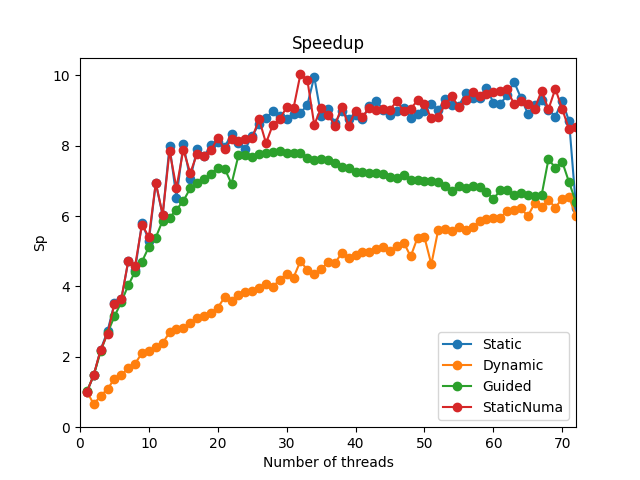

9 Parallelization
=================

Links
-----

`Github Repo <https://github.com/Minutenreis/tsunami_lab>`_

`User Doc <https://tsunami-lab.readthedocs.io/en/latest/>`_

Individual Contributions
------------------------

Justus Dreßler: all members contributed equally

Thorsten Kröhl: all members contributed equally

Julius Halank: all members contributed equally

9.1 & 9.3 Parallelize Solver with OpenMP
----------------------------------------

We parallelized our solver with OpenMP pragmas. We added them in the following parts of :code:`WavePropagation2d`:

.. code:: cpp

  void tsunami_lab::patches::WavePropagation2d::timeStep(t_real i_scaling)
  {
    setGhostCellsX();
  // init new cell quantities
  #pragma omp parallel for simd
    for (t_idx l_cy = 0; l_cy < m_nCellsy + 1; l_cy++)
      for (t_idx l_cx = 0; l_cx < m_nCellsx + 1; l_cx++)
      {
        m_hTemp[getCoord(l_cx, l_cy)] = m_h[getCoord(l_cx, l_cy)];
        m_huvTemp[getCoord(l_cx, l_cy)] = m_hu[getCoord(l_cx, l_cy)];
      }

  // iterate over edges and update with Riemann solutions in x direction
  #pragma omp parallel for
    for (t_idx l_ey = 0; l_ey < m_nCellsy + 1; l_ey++)
      for (t_idx l_ex = 0; l_ex < m_nCellsx + 1; l_ex++)
      {
        // determine left and right cell-id
        t_idx l_ceL = getCoord(l_ex, l_ey);
        t_idx l_ceR = getCoord(l_ex + 1, l_ey);

        // compute net-updates
        t_real l_netUpdates[2][2];

        /* Calc Updates */

        // update the cells' quantities
        m_h[l_ceL] -= i_scaling * l_netUpdates[0][0];
        m_hu[l_ceL] -= i_scaling * l_netUpdates[0][1];

        m_h[l_ceR] -= i_scaling * l_netUpdates[1][0];
        m_hu[l_ceR] -= i_scaling * l_netUpdates[1][1];
      }

    setGhostCellsY();

  // init new cell quantities
  #pragma omp parallel for simd
    for (t_idx l_cy = 0; l_cy < m_nCellsy + 1; l_cy++)
      for (t_idx l_cx = 0; l_cx < m_nCellsx + 1; l_cx++)
      {
        m_hTemp[getCoord(l_cx, l_cy)] = m_h[getCoord(l_cx, l_cy)];
        m_huvTemp[getCoord(l_cx, l_cy)] = m_hv[getCoord(l_cx, l_cy)];
      }

  // iterate over edges and update with Riemann solutions in y direction
  #pragma omp parallel for
    for (t_idx l_ex = 0; l_ex < m_nCellsx + 1; l_ex++)
      for (t_idx l_ey = 0; l_ey < m_nCellsy + 1; l_ey++)
      {
        // determine top and bottom cell-id
        t_idx l_ceB = getCoord(l_ex, l_ey);
        t_idx l_ceT = getCoord(l_ex, l_ey + 1);

        // compute net-updates
        t_real l_netUpdates[2][2];

        /* Calc Updates */

        // update the cells' quantities
        m_h[l_ceB] -= i_scaling * l_netUpdates[0][0];
        m_hv[l_ceB] -= i_scaling * l_netUpdates[0][1];

        m_h[l_ceT] -= i_scaling * l_netUpdates[1][0];
        m_hv[l_ceT] -= i_scaling * l_netUpdates[1][1];
      }
  }

We swapped the order of the second loop back so we could parallelize the outer loop without inducing dependencies between threads.
We also found a significant performance drop when we parallelized the inner loop.
Its probably caused by the massive overhead of creating and destroying threads for each outer loop iteration.
Parallelizing the inner loop raised our time per cell and iteration from 5ns to over 50ns (worse than the not parallelized code that runs at roughly 28ns).

We also parallelized our NetCdf output (since it was the second significant time consumer after the solver):

.. code:: cpp

  void tsunami_lab::io::NetCdf::putVaraWithGhostcells(t_real const *i_data, int l_ncidp, int i_var, t_idx i_nOut, bool i_hasTime)
  {
      t_idx l_time = i_hasTime ? 0 : 1; // if it has no time, start array at 1st index
      t_idx start_p[3] = {i_nOut, 0, 0};
      t_idx count_p[3] = {1, 1, m_nx / m_k};
      t_idx l_sizeX = (m_nx / m_k) * m_k; // m_nx/k*k (integer division) => ignores the overstanding cells at the right border
      t_real l_kSquaredInv = 1.0 / (m_k * m_k);
      for (start_p[1] = 0; start_p[1] < m_ny / m_k; ++start_p[1])
      {
          // zero initialised array for averaged data
          t_real *l_row = new t_real[m_nx / m_k]{};
          for (t_idx l_iy = start_p[1] * m_k; l_iy < (start_p[1] + 1) * m_k; ++l_iy)
          {
  #pragma omp parallel for schedule(static, m_k)
              for (t_idx l_ix = 0; l_ix < l_sizeX; ++l_ix)
              {
                  l_row[l_ix / m_k] += i_data[l_ix + m_ghostCellsX + (l_iy + m_ghostCellsY) * m_stride];
              }
          }
          for (t_idx l_ix = 0; l_ix < m_nx / m_k; ++l_ix)
          {
              l_row[l_ix] *= l_kSquaredInv;
          }
          ncCheck(nc_put_vara_float(l_ncidp, i_var, start_p + l_time, count_p + l_time, l_row), __FILE__, __LINE__);
          delete[] l_row;
      }
  }

We chose the chunk size to be :code:`m_k` so that only one thread writes to one memory location on :code:`l_row`.

9.2 & 9.4 Runtime Parallel Solver with various Scheduling Strategies
--------------------------------------------------------------------

To make the solutions comparable to `8 Optimization`_ we also used :code:`./build/tsunami_lab -i -u "Tsunami2d output/tohoku_gebco20_usgs_250m_displ.nc output/tohoku_gebco20_usgs_250m_bath.nc 18000" 4000` as config.

+------------------------------------+--------------------+----------+
| Threads                            | Time per Iteration | Speedup  |
+====================================+====================+==========+
| 1                                  | 32.1518ns          | 1        |
+------------------------------------+--------------------+----------+
| 2                                  | 22.319ns           | 1.44     |
+------------------------------------+--------------------+----------+
| 4                                  | 12.6621ns          | 2.54     |
+------------------------------------+--------------------+----------+
| 8                                  | 7.4102ns           | 4.34     |
+------------------------------------+--------------------+----------+
| 18                                 | 4.2277ns           | 7.61     |
+------------------------------------+--------------------+----------+
| 19                                 | 3.9498ns           | 8.14     |
+------------------------------------+--------------------+----------+
| 24                                 | 3.5812ns           | 8.98     |
+------------------------------------+--------------------+----------+
| 36                                 | 3.2944ns           | 9.76     |
+------------------------------------+--------------------+----------+
| 37                                 | 3.8388ns           | 8.38     |
+------------------------------------+--------------------+----------+
| 48                                 | 3.73346ns          | 8.61     |
+------------------------------------+--------------------+----------+
| 72                                 | 4.6691ns           | 6.89     |
+------------------------------------+--------------------+----------+

    Speedup of the parallel solver over number of threads averaged over 3 runs. |br|
    Static: static scheduling |br|
    Dynamic: dynamic scheduling |br|
    Guided: guided scheduling |br|
    StaticNuma: static scheduling with :code:`OMP_PLACES=numa_domains`

The static solver seems to rise in performance approximately linear until 16 threads and then only very slowly rises over the remaining threads.
Using all threads imposed an interesting drastic drop in performance, probably because the last thread was also responsible for other programs and unbalances our workload.
Our maximum seems to be at 34 Threads so 2 threads short of 1 thread per core.
Enabling NUMA pinning seemed to make no difference.

The dynamic solver interestingly decreases in performance on 2 threads and then rises slowly with each added thread. 
It is significantly slower than the static solver though (losing approximately 1/3 of the performance), so we won't further consider using this for the time being.

The guided solver starts off with a similar performance to the static solver but then lowers itself to the dynamic solver.
This could be caused by our comparitively small workload and the guided scheduler not being able to find a good chunk size for our workload.
It would need further testing at significantly larger workloads to be able to make a statement about its performance.

In our opinion the default :code:`#pragma omp parallel for` with static scheduling is the best choice for our workload.
All other schedulers seem to be either slower or not significantly faster than the static scheduler, but more prone to implementation errors.

We ensure NUMA aware initialization by using static scheduling with the same iteration variables for the first 3 loops.
We for now did not keep that awareness for the fourth loop, because that would add dependencies in the update loop and we would have to use :code:`#pragma omp atomic`.
We did not want to get that performance hit for now (and currently it runs on maximum 1 node so the remote memory access is not that bad).
We should hit the correct memory locations for 87.5% of the cells (first 3 loops completely and 4th loop should hit about half the time).
For the Code used look in `9.1 & 9.3 Parallelize Solver with OpenMP`_

.. |br| raw:: html

       